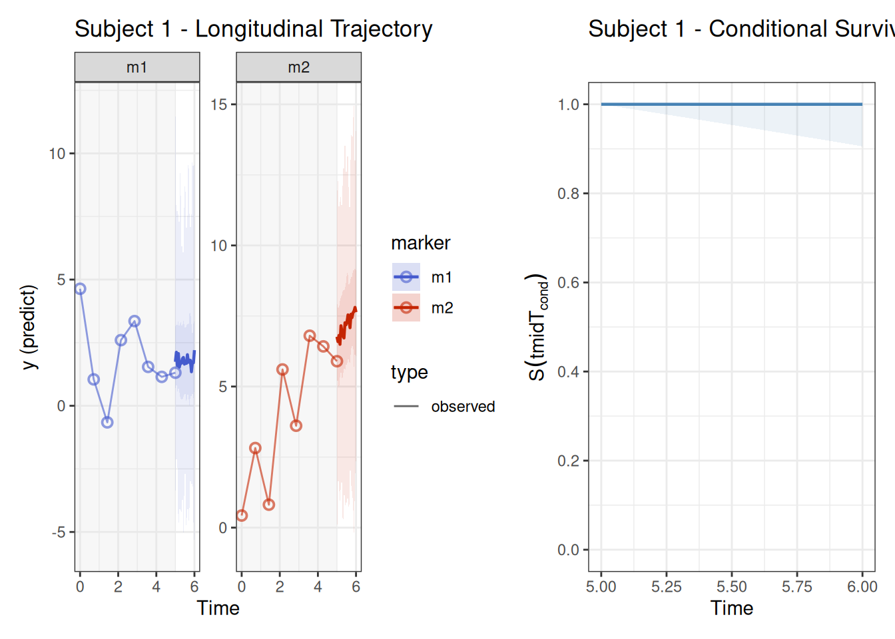

# Introduction to Joint Nested Mixed Effects Models

## Installation

``` r

# install.packages("remotes")
# remotes::install_github("trinhdhk/JoiNMe")
```

For Stan backends:

``` r

# CmdStanR backend (recommended)
# install.packages("cmdstanr", repos = c("https://mc-stan.org/r-packages/", getOption("repos")))
# cmdstanr::install_cmdstan()

# RStan backend (optional)
# install.packages("rstan", repos = c("https://mc-stan.org/r-packages/", getOption("repos")))
```

## Quick start

## Conceptual overview

The `JoiNMe` model links two components:

1.  A multivariate longitudinal model for repeated biomarker
    measurements.
2.  A survival model whose hazard depends on summaries of the
    longitudinal process at time t.

For the longitudinal part, each marker can follow its own distribution
(Gaussian, Student-t, Poisson, negative binomial, Bernoulli, beta, skew
families, or ordinal). The linear predictor is decomposed into fixed
effects, subject-level random effects, marker-level random effects, and
optional marker-by-subject random effects. The survival part uses a
proportional hazards model with a flexible spline baseline hazard and
time-dependent association terms.

The association terms implemented in `joinme` package are:

- Current value (CV) of the latent linear predictor.
- Current slope (CS) of the latent linear predictor.
- Correlation association (CORR) derived from off-diagonal
  marker-by-subject correlations.
- Variance-covariance association (VCOV) derived from lower-triangular
  marker-by-subject Cholesky-factor entries taken directly from `L`.

Each association term can be left on its original scale or transformed
using a functional expression, a monotone I-spline, or an ordered
piecewise-linear mapping.

## Family-shared distributional semantics

For mixed longitudinal families, `JoiNMe` treats distributional
parameters as **shared by family** when no distributional regression is
supplied.

Concretely:

- Markers with the same family share one latent baseline process for
  each applicable distributional parameter.
- Markers from different families do not share those baselines.
- Parameters are instantiated only when a family uses them (for example
  `nu` for Student-`t`, `phi` for negative-binomial).

Example interpretation:

- If markers `A` and `B` are both Student-`t` and marker `C` is
  Gaussian, then `A` and `B` share the same baseline `sigma` and `nu`
  processes, while `C` has its own `sigma` process and no `nu`.

### What changes when `formulaDist` is provided?

Supplying a distributional regression (for example `sigma ~ 1 + time`)
switches that parameter from a family-level constant baseline to a
regression-driven process. In that mode, summaries report distributional
regression coefficients (`(Intercept)`, covariate effects, and
random-effect SD terms when present) rather than only baseline family
constants.

Illustrative `formulaDist` specification:

``` r

formulaDist <- list(
  sigma ~ 1 + time,
  nu ~ 1
)
```

This means:

- `sigma` is modelled through regression (fixed/random effects if
  included),
- `nu` is regression-driven with an intercept-only structure,
- other distributional parameters without formulas continue using
  family-shared baselines when applicable.

## Data requirements (minimal)

You need two data frames:

- `dataLong`: long-format longitudinal data with columns for subject id,
  marker id, time, outcome, and covariates.
- `dataEvent`: one row per subject with event/censoring time, event
  indicator, and baseline covariates.

Time is internally scaled to \[0, 1\] for numerical stability. The model
returns coefficients on the original time scale.

### Step 1: Load packages and set a reproducible seed

``` r

if (!require('joinme', quietly = TRUE)) {
  if (requireNamespace("devtools", quietly = TRUE) && file.exists(file.path(repo_root, "DESCRIPTION"))) {
    devtools::load_all(repo_root, quiet = TRUE)
  } else {
    try(base::attachNamespace("joinme"), silent = TRUE)
  }
}
library(survival)

set.seed(2026)
```

### Step 2: Simulate a small dataset

We generate a modest dataset so the workflow runs quickly while still
containing both longitudinal and survival information.

``` r

sim <- simulate_joinme(
  n_id = 10,
  families = list(
    jm_family("student_t"),
    jm_family("student_t")
  ),
  n_obs_per_marker_per_id = 4,
  times_obs = seq(0, 5, length.out = 8),
  baseline_hazard = list(type='weibull', shape = 2, scale = 20),
  quadrature_nodes = 31,
  seed = 2026,
  assoc = c("cv_total"),
  assoc_coefs = c(cv_total = 0.6)
)

# Gauss-Kronrod nodes/weights are fixed in Stan; `quadrature_nodes` selects
# the node count used to build the design matrices in R.

head(sim$dataLong)
```

      id marker      time        x1         x2           y
    1  1     m1 0.0000000 0.5205891 -0.4082147  1.48029644
    2  1     m1 0.7142857 0.5205891 -0.4082147  0.07483799
    3  1     m1 1.4285714 0.5205891 -0.4082147  3.03390024
    4  1     m1 2.1428571 0.5205891 -0.4082147 -0.51783329
    5  1     m1 2.8571429 0.5205891 -0.4082147  2.91889528
    6  1     m1 3.5714286 0.5205891 -0.4082147  3.55619061

``` r

head(sim$dataEvent)
```

      id          x1         x2     time event time_start time_stop
    1  1  0.52058907 -0.4082147 4.511976     1          0  4.511976
    2  2 -1.07969076 -0.7304333 3.123275     1          0  3.123275
    3  3  0.13923812 -0.2214366 8.000000     0          0  8.000000
    4  4 -0.08474878 -0.2258165 3.676778     1          0  3.676778
    5  5 -0.66663962 -2.5468814 8.000000     0          0  8.000000
    6  6 -2.51608903  1.3470015 8.000000     0          0  8.000000

### Step 3: Specify longitudinal and survival models

The longitudinal formula defines fixed effects and random effects. The
survival formula defines baseline covariates in the hazard model.

Formula-scoped weighting can be declared directly in grouping terms via
`weighted(group, weights = <column>)`, including marker-level grouping
declarations.

``` r

formulaLong <- y ~ 1 + time + x1 +
  (1 + time || id) +
  (0 + x1 + (1 + time || id) || marker)

formulaEvent <- survival::Surv(time, event) ~ 1 + x1 + x2
```

``` r

formulaLong_weighted <- y ~ 1 + time + x1 +
  (1 + time | weighted(id, weights = id_w)) +
  (0 + x1 + (1 + time | weighted(id, weights = id_w)) | weighted(marker, weights = marker_w))
```

### Step 4: Fit the joint model

We link the survival hazard to the current value (CV) of the
longitudinal process using an identity transformation.

``` r

fit <- joinme(
  formulaLong = formulaLong,
  dataLong = sim$dataLong,
  formulaEvent = formulaEvent,
  dataEvent = sim$dataEvent,
  assoc = c("cv_total"),
  families = "student_t",
  transforms = joinme_tf(cv_total = "identity"),
  basehaz = joinme_basehaz('bs'), 
  control = list(
    engine = "rstan",
    chains = 1,
    parallel_chains = 1,
    iter_warmup = 500,
    iter_sampling = 500,
    seed = 2026,
    refresh = 0,
    adapt_delta = 0.85
  )
)
```

### Step 5: Summarise fixed effects and associations

``` r

summary(fit) # or posterior_summary(fit)fixef(fit)
```


    Joint mixed effects model summary
    • Call: joinme(formulaLong = formulaLong, dataLong = sim$dataLong, formulaEvent = formulaEvent, dataEvent = sim$dataEvent, control = list(engine = "rstan", chains = 1, parallel_chains = 1, iter_warmup = 500, iter_sampling = 500, seed = 2026, refresh = 0, adapt_delta = 0.85), families = "student_t", transforms = joinme_tf(cv_total = "identity"), basehaz = joinme_basehaz("bs"), assoc = c("cv_total"))
    • Family: student_t, student_t
    • Baseline hazard type: bs
    • tmax: 8

    Sampler diagnostics
    # A tibble: 11 × 2
       metric               value
       <chr>                <chr>
     1 draws                500
     2 divergences          2
     3 treedepth_hits       0
     4 ebfmi_min            0.815
     5 max_rhat             1.02
     6 min_ess_bulk         82.17
     7 min_ess_tail         88.515
     8 n_terms_total        28
     9 n_terms_bad_rhat     4
    10 n_terms_low_ess_bulk 4
    11 n_terms_low_ess_tail 2

    Transformations
    # A tibble: 1 × 2
      term     formula
      <chr>    <chr>
    1 cv_total identity

    Fixed effects (beta)
    # A tibble: 3 × 8
      term        Estimate Est.Error   Q2.5 Q97.5  Rhat ess_bulk ess_tail
      <chr>          <dbl>     <dbl>  <dbl> <dbl> <dbl>    <dbl>    <dbl>
    1 (Intercept)    1.25      0.744 -0.229 2.75  1.02      174.     142.
    2 time           0.038     0.139 -0.228 0.328 1.01      214.     232.
    3 x1            -0.264     0.679 -1.48  0.996 0.999     150.     188.

    Baseline hazard coefficients
    # A tibble: 8 × 11
      term  Estimate Hazard.Ratio Est.Error   Q2.5  Q97.5 HR.Q2.5 HR.Q97.5  Rhat
      <chr>    <dbl>        <dbl>     <dbl>  <dbl>  <dbl>   <dbl>    <dbl> <dbl>
    1 1       -7.70         0         3.01  -13.9  -2.23    0        0.107 0.999
    2 2       -0.949        0.387     1.13   -3.34  0.989   0.036    2.69  0.999
    3 3       -0.672        0.511     0.935  -2.88  0.874   0.056    2.40  1.00
    4 4       -0.394        0.674     0.86   -2.13  1.14    0.119    3.13  0.999
    5 5       -0.111        0.895     0.83   -1.89  1.38    0.151    3.96  1.00
    6 6        0.218        1.24      0.839  -1.55  1.70    0.212    5.48  1.00
    7 7        0.548        1.73      0.929  -1.26  2.24    0.285    9.41  1.00
    8 8        0.894        2.44      1.17   -1.16  3.22    0.314   25.0   1.02
      ess_bulk ess_tail
         <dbl>    <dbl>
    1    468.     313.
    2    158.      88.5
    3    111.     120.
    4     89.4    110.
    5     85.2    184.
    6     91.7     98.1
    7    123.     103.
    8    226.     369.

    Survival process (non-association covariates)
    # A tibble: 2 × 11
      term  Estimate Hazard.Ratio Est.Error   Q2.5 Q97.5 HR.Q2.5 HR.Q97.5  Rhat
      <chr>    <dbl>        <dbl>     <dbl>  <dbl> <dbl>   <dbl>    <dbl> <dbl>
    1 x1       1.22          3.37     0.703  0.085  2.68   1.09     14.6  0.999
    2 x2       0.366         1.44     0.561 -0.614  1.60   0.541     4.95 1
      ess_bulk ess_tail
         <dbl>    <dbl>
    1     505.     385.
    2     478.     372.

    Association parameters
    # A tibble: 5 × 8
      term       Estimate Est.Error   Q2.5 Q97.5  Rhat ess_bulk ess_tail
      <chr>         <dbl>     <dbl>  <dbl> <dbl> <dbl>    <dbl>    <dbl>
    1 cv_total      0.362     0.493  0.005  1.54 0.999     293.     471.
    2 weight: m1    0.241     0.953 -1.70   2.03 1.01      492.     369.
    3 weight: m2    0.267     0.888 -1.61   1.88 1.00      534.     313.
    4 weight: m1    0.241     0.953 -1.70   2.03 1.01      492.     369.
    5 weight: m2    0.267     0.888 -1.61   1.88 1.00      534.     313.

    Distributional parameters
    # A tibble: 2 × 8
      term                  Estimate Est.Error  Q2.5 Q97.5  Rhat ess_bulk ess_tail
      <chr>                    <dbl>     <dbl> <dbl> <dbl> <dbl>    <dbl>    <dbl>
    1 sigma[family=student]     1.40     0.156  1.12  1.71  1.01     299.     352.
    2 nu[family=student]        3.32     0.943  2.10  5.82  1.01     393.     328.

    Covariance summaries (diagonal entries are variances)

    id
    # A tibble: 2 × 10
      block row         col         Estimate Est.Error     Q2.5 Q97.5  Rhat ess_bulk
      <chr> <chr>       <chr>          <dbl>     <dbl>    <dbl> <dbl> <dbl>    <dbl>
    1 id    (Intercept) (Intercept)   0.360      0.479 0.000278 1.61   1.01     189.
    2 id    time        time          0.0947     0.119 0.000217 0.409  1.01     203.
      ess_tail
         <dbl>
    1     173.
    2     295.

    marker
    # A tibble: 2 × 10
      block  row         col         Estimate Est.Error     Q2.5 Q97.5  Rhat
      <chr>  <chr>       <chr>          <dbl>     <dbl>    <dbl> <dbl> <dbl>
    1 marker x1          x1             0.603      1.39 0.000420  4.25 0.998
    2 marker (Intercept) (Intercept)    0.739      1.41 0.000172  4.56 1.02
      ess_bulk ess_tail
         <dbl>    <dbl>
    1     154.     202.
    2     259.     188.

    id:marker covariance parameters

    covariance regression coefficients
    # A tibble: 4 × 11
      block         row         col         term        Estimate Est.Error   Q2.5
      <chr>         <chr>       <chr>       <chr>          <dbl>     <dbl>  <dbl>
    1 SD[id:marker] (Intercept) (Intercept) (Intercept)    0.388     0.615 -0.909
    2 SD[id:marker] time        time        (Intercept)   -1.38      0.795 -3.28
    3 SD[id:marker] (Intercept) (Intercept) lambda         0.592     0.515  0.024
    4 SD[id:marker] time        time        lambda         0.68      0.553  0.028
       Q97.5  Rhat ess_bulk ess_tail
       <dbl> <dbl>    <dbl>    <dbl>
    1  1.53   1.02    188.      253.
    2 -0.197  1.00     82.2     140.
    3  1.76   1.00    225.      220.
    4  2.10   1.01    143.      272.

``` r

coef(fit)
```

    $formulaLong
    $formulaLong$id
       id        term Estimate Est.Error   Q2.5 Q97.5  Rhat ess_bulk ess_tail
    1   1 (Intercept)    1.538     0.859 -0.015 3.235 0.999 161.4827 228.3575
    2   1        time    0.224     0.272 -0.233 0.867 1.009 221.3702 353.1196
    3  10 (Intercept)    1.137     0.833 -0.475 2.781 1.006 181.6464 166.2512
    4  10        time   -0.043     0.201 -0.462 0.310 0.998 268.0764 428.3560
    5   2 (Intercept)    1.562     0.911 -0.061 3.440 1.003 159.6310 195.6196
    6   2        time    0.140     0.263 -0.329 0.712 1.003 303.7589 337.3771
    7   3 (Intercept)    0.915     0.923 -1.142 2.600 1.007 165.9566 155.6664
    8   3        time   -0.052     0.234 -0.513 0.460 1.004 234.8977 235.5922
    9   4 (Intercept)    1.458     0.914 -0.432 3.294 1.000 156.9213 175.5777
    10  4        time    0.155     0.274 -0.354 0.768 1.000 433.2132 374.3784
    11  5 (Intercept)    1.085     0.887 -0.521 2.828 1.022 162.1541 144.4543
    12  5        time    0.103     0.215 -0.318 0.530 1.005 318.6891 352.1886
    13  6 (Intercept)    1.259     0.929 -0.531 3.137 1.016 194.3037 170.7974
    14  6        time   -0.243     0.292 -0.827 0.254 1.000 119.0005 328.3563
    15  7 (Intercept)    1.246     0.818 -0.310 2.873 1.013 169.2585 141.0987
    16  7        time    0.028     0.207 -0.388 0.447 1.002 316.8034 272.1877
    17  8 (Intercept)    1.284     0.830 -0.316 3.043 1.000 182.3833 176.2787
    18  8        time   -0.120     0.250 -0.652 0.311 1.000 281.7043 381.4196
    19  9 (Intercept)    1.053     0.857 -0.580 2.794 1.015 195.5996 148.4858
    20  9        time    0.149     0.241 -0.238 0.749 1.024 226.5911 200.3026

    $formulaLong$marker
      marker        term Estimate Est.Error   Q2.5 Q97.5  Rhat ess_bulk ess_tail
    1     m1 (Intercept)    1.388     0.569  0.332 2.445 1.004 267.0664 291.1889
    2     m1          x1   -0.336     0.547 -1.378 0.716 1.011 248.0292 258.2404
    3     m2 (Intercept)    1.200     0.533  0.154 2.187 1.004 253.1809 271.2551
    4     m2          x1   -0.271     0.567 -1.487 0.834 0.998 243.7600 327.9930

    $formulaLong$marker_by_id
       id marker        term Estimate Est.Error   Q2.5 Q97.5  Rhat ess_bulk
    1   1     m1 (Intercept)    1.304     1.001 -0.648 3.373 1.009 209.4971
    2   1     m1        time    0.229     0.320 -0.290 0.939 0.998 130.1531
    3   1     m2 (Intercept)    2.311     1.055  0.452 4.530 1.018 145.4490
    4   1     m2        time    0.098     0.284 -0.396 0.713 1.000 303.7502
    5  10     m1 (Intercept)    1.356     0.903 -0.534 3.014 1.006 179.2048
    6  10     m1        time   -0.062     0.227 -0.558 0.357 1.006 275.1311
    7  10     m2 (Intercept)    0.692     0.973 -1.275 2.411 1.013 206.7226
    8  10     m2        time    0.040     0.211 -0.343 0.483 1.001 446.7727
    9   2     m1 (Intercept)    1.971     1.031  0.017 4.188 1.010 231.3699
    10  2     m1        time    0.116     0.303 -0.394 0.830 1.000 224.3538
    11  2     m2 (Intercept)    1.730     1.096 -0.290 4.085 1.004 217.0188
    12  2     m2        time    0.082     0.294 -0.400 0.796 1.000 319.1456
    13  3     m1 (Intercept)    1.294     0.953 -0.589 3.312 0.999 205.8007
    14  3     m1        time   -0.033     0.236 -0.547 0.412 1.021 194.2019
    15  3     m2 (Intercept)    0.068     1.066 -2.002 2.157 1.001 172.2744
    16  3     m2        time   -0.036     0.243 -0.531 0.418 0.999 236.8587
    17  4     m1 (Intercept)    1.730     1.013 -0.262 3.786 1.001 251.2587
    18  4     m1        time    0.167     0.307 -0.340 0.830 0.998 178.2526
    19  4     m2 (Intercept)    1.629     0.965 -0.163 3.679 1.011 235.8572
    20  4     m2        time    0.016     0.283 -0.540 0.559 1.022 210.9368
    21  5     m1 (Intercept)    0.422     0.995 -1.680 2.247 1.001 200.2079
    22  5     m1        time    0.037     0.229 -0.405 0.507 1.000 267.2137
    23  5     m2 (Intercept)    1.515     1.057 -0.456 3.599 1.003 239.8867
    24  5     m2        time    0.113     0.228 -0.315 0.602 0.999 249.9795
    25  6     m1 (Intercept)    0.773     1.252 -2.140 3.038 1.014 207.8545
    26  6     m1        time   -0.200     0.309 -0.877 0.280 1.010 166.7081
    27  6     m2 (Intercept)    1.769     1.288 -0.678 4.533 1.002 240.7974
    28  6     m2        time   -0.205     0.341 -0.949 0.360 1.017 137.6401
    29  7     m1 (Intercept)    2.210     1.068  0.215 4.301 1.024 252.8865
    30  7     m1        time    0.126     0.274 -0.343 0.727 0.998 303.4779
    31  7     m2 (Intercept)    0.139     1.017 -2.215 2.195 1.010 200.0527
    32  7     m2        time   -0.032     0.241 -0.533 0.438 0.999 305.0333
    33  8     m1 (Intercept)    1.654     1.070 -0.569 3.845 1.001 216.2919
    34  8     m1        time    0.233     0.333 -0.270 0.975 0.998 286.1377
    35  8     m2 (Intercept)    0.817     1.036 -1.271 2.695 1.006 168.4718
    36  8     m2        time   -0.437     0.366 -1.145 0.176 1.005 115.7220
    37  9     m1 (Intercept)    0.450     1.112 -1.768 2.443 1.009 173.3685
    38  9     m1        time    0.181     0.295 -0.311 0.883 1.000 223.2111
    39  9     m2 (Intercept)    1.445     0.855 -0.177 3.219 1.022 228.7602
    40  9     m2        time    0.061     0.230 -0.376 0.561 0.999 299.0908
       ess_tail
    1  220.3563
    2  213.0757
    3  175.9566
    4  257.7729
    5  217.7673
    6  360.8120
    7  245.8280
    8  473.9927
    9  187.0602
    10 305.5157
    11 256.6771
    12 348.3075
    13 157.7336
    14 323.4567
    15 252.4778
    16 314.8640
    17 232.2358
    18 239.4328
    19 213.8236
    20 348.4754
    21 181.8886
    22 273.7265
    23 231.1912
    24 297.7492
    25 217.3698
    26 371.1017
    27 213.8236
    28 242.5881
    29 198.0070
    30 415.8921
    31 196.0713
    32 313.4341
    33 245.2622
    34 352.1886
    35 249.5239
    36 202.3624
    37 192.7907
    38 302.2125
    39 122.4135
    40 363.5387

    $formulaLong$assoc_weight
            term Estimate Est.Error   Q2.5 Q97.5  Rhat ess_bulk ess_tail
    1 weight: m1    0.241     0.953 -1.697 2.030 1.007 484.3536 369.4218
    2 weight: m2    0.267     0.888 -1.614 1.885 1.003 485.1652 312.7750

    $formulaLong$population
             term Estimate Est.Error   Q2.5 Q97.5  Rhat ess_bulk ess_tail
    1 (Intercept)    1.253     0.744 -0.229 2.750 1.016 151.5226 142.4771
    2        time    0.038     0.139 -0.228 0.328 1.006 212.0773 232.3288
    3          x1   -0.264     0.679 -1.482 0.996 0.999 133.5771 188.0771


    $formulaEvent
      event term Estimate Est.Error   Q2.5 Q97.5  Rhat ess_bulk ess_tail
    1 event   x1    1.215     0.703  0.085 2.678 0.999 503.0121 385.4308
    2 event   x2    0.366     0.561 -0.614 1.599 1.000 452.4316 372.0591
      Hazard.Ratio HR.Q2.5 HR.Q97.5
    1        3.370   1.089   14.556
    2        1.442   0.541    4.948

    $formulaDist
    list()

    $formulaVCov
    $formulaVCov$population
    NULL

    $formulaVCov$id
       id         block row col        term Estimate Est.Error   Q2.5 Q97.5  Rhat
    1   1 SD[id:marker]   1   1 (Intercept)    0.077     0.746 -1.423 1.376 1.001
    2   1 SD[id:marker]   2   2 (Intercept)   -0.105     0.724 -1.724 1.333 1.006
    3  10 SD[id:marker]   1   1 (Intercept)   -0.157     0.710 -2.066 1.075 0.999
    4  10 SD[id:marker]   2   2 (Intercept)   -0.300     0.771 -2.703 0.707 1.006
    5   2 SD[id:marker]   1   1 (Intercept)   -0.047     0.701 -1.574 1.425 1.001
    6   2 SD[id:marker]   2   2 (Intercept)   -0.157     0.969 -2.477 1.494 1.000
    7   3 SD[id:marker]   1   1 (Intercept)    0.072     0.614 -1.266 1.348 1.001
    8   3 SD[id:marker]   2   2 (Intercept)   -0.206     0.847 -2.222 1.256 1.000
    9   4 SD[id:marker]   1   1 (Intercept)   -0.040     0.743 -1.800 1.298 0.998
    10  4 SD[id:marker]   2   2 (Intercept)   -0.115     0.729 -1.842 1.276 1.000
    11  5 SD[id:marker]   1   1 (Intercept)    0.014     0.702 -1.606 1.529 0.998
    12  5 SD[id:marker]   2   2 (Intercept)   -0.160     0.770 -1.935 1.127 1.006
    13  6 SD[id:marker]   1   1 (Intercept)    0.036     0.824 -1.510 1.714 1.010
    14  6 SD[id:marker]   2   2 (Intercept)    0.010     0.778 -1.700 1.623 0.998
    15  7 SD[id:marker]   1   1 (Intercept)    0.206     0.748 -0.790 1.836 0.999
    16  7 SD[id:marker]   2   2 (Intercept)   -0.166     0.750 -1.986 1.157 1.007
    17  8 SD[id:marker]   1   1 (Intercept)   -0.116     0.754 -2.084 1.291 0.999
    18  8 SD[id:marker]   2   2 (Intercept)    0.307     0.769 -1.112 2.194 1.017
    19  9 SD[id:marker]   1   1 (Intercept)    0.011     0.715 -1.518 1.535 1.004
    20  9 SD[id:marker]   2   2 (Intercept)   -0.134     0.819 -2.034 1.426 1.009
       ess_bulk ess_tail
    1  280.6438 295.3432
    2  247.7043 270.4578
    3  329.5843 320.4628
    4  325.2404 333.2991
    5  355.6453 301.1448
    6  292.0231 268.6386
    7  315.3967 382.0824
    8  432.6058 343.0167
    9  533.0388 326.9978
    10 289.8052 353.1196
    11 433.1850 194.7111
    12 465.8460 310.2606
    13 385.8720 312.4465
    14 292.1161 323.0160
    15 242.2406 374.1132
    16 366.0293 365.0928
    17 414.7238 399.8404
    18 179.3260 232.3136
    19 356.7070 387.1280
    20 361.7987 374.3784

``` r

posterior_assoc(fit, summary = TRUE)
```


    Posterior association effects

    Association term: cv_total
    # A tibble: 2 × 8
      term  Estimate Est.Error   Q2.5 Q97.5  Rhat ess_bulk ess_tail
      <chr>    <dbl>     <dbl>  <dbl> <dbl> <dbl>    <dbl>    <dbl>
    1 m1       0.04      0.148 -0.228 0.375 0.999     334.     331.
    2 m2       0.064     0.183 -0.174 0.605 0.999     339.     347.

[`posterior_summary()`](https://paulbuerkner.com/brms/reference/posterior_summary.html)
is an alias for [`summary()`](https://rdrr.io/r/base/summary.html).
[`posterior_assoc()`](https://trinhdhk.github.io/joinme/reference/assoc.md)
returns association-specific posterior output in a format that stays
close to the main summary tables. For covariance-style channels (`corr`,
`vcov`), the printed and tabular output now uses readable matrix labels
instead of raw numeric indices.
[`coef()`](https://rdrr.io/r/stats/coef.html) returns coefficients on
the model-matrix scale after adding the population-level contribution
and the matching group-level deviation. As with
[`fixef()`](https://rdrr.io/pkg/nlme/man/fixed.effects.html) and
[`ranef()`](https://rdrr.io/pkg/nlme/man/random.effects.html), use
`summary = FALSE` to retrieve posterior draws instead of posterior
summaries.

### Step 6: Dynamic prediction for one subject

We condition on the observed history up to the last measurement for
subject 1 and obtain predictive summaries beyond that time.

``` r

ndL <- sim$dataLong[sim$dataLong$id == 1, ]
ndE <- sim$dataEvent[sim$dataEvent$id == 1, ]
time_start <- max(ndL$time)

pred <- posterior_predict(
  fit,
  newdataLong = ndL,
  newdataEvent = ndE,
  time_start = time_start,
  times = seq(time_start, time_start + 1, length.out = 20),
  control = list(
    n_samples = 50, 
    n_pred_draws = 1000,
    iter_warmup = 200,
    chains = 1
    ),
  seed = 2026
)
```


      |
      |                                                            |   0%


      |
      |============================================================| 100%

``` r

# control$n_samples: extracted posterior parameter draws
# control$n_pred_draws: dynpred output draw count

# use predict(..., scale = c("epred", "linpred", "predict"))
# to return multiple longitudinal scales in one call (default = all scales)
```

### Step 7: Plot longitudinal and survival predictions

``` r

plot(pred, type = c("longitudinal", "survival"), combined = TRUE)
```



If `patchwork`/`cowplot` is unavailable, `combined = TRUE` falls back to
the standard per-subject structured return (grouped by subject and
outcome) instead of any flattened helper list.

The heatmap is an alternative to the usual separated marker curves. It
orders markers by the magnitude of posterior mean change and makes tiles
transparent when the posterior sign certainty does not exceed
`1 - threshold`.

`plot(fit, ...)` uses fitted posterior samples directly and has no
conditioning argument. Conditional covariate profiles are evaluated with
[`conditional_effects()`](https://paulbuerkner.com/brms/reference/conditional_effects.brmsfit.html),
while [`predict()`](https://rdrr.io/r/stats/predict.html) remains
reserved for dynamic subject-specific forecasts given observed
longitudinal history.

``` r

profiles <- make_conditions(sim$dataEvent, vars = "x1")

effects_data <- conditional_effects(
  fit,
  effects = list(longitudinal = "time", event = "x1"),
  conditions = profiles,
  process = c("longitudinal", "event"),
  longitudinal_estimand = "population",
  plot = FALSE
)

plot(effects_data, ask = FALSE)
```

For the longitudinal process, set `longitudinal_estimand = "marker"` to
add the fitted marker-level deviation, or use `"marginal_marker"` to
average marker-specific predictions within each posterior draw. This
latter estimand applies each marker’s inverse link before averaging, so
it represents the average expected marker response rather than the
response of an average marker.

### Step 8: Diagnostics and extraction helpers

``` r

diagnosis(fit)
```


    Diagnostics Summary
    # A tibble: 11 × 2
       metric               value
       <chr>                <chr>
     1 draws                500
     2 divergences          2
     3 treedepth_hits       0
     4 ebfmi_min            0.815
     5 max_rhat             1.02
     6 min_ess_bulk         82.17
     7 min_ess_tail         88.515
     8 n_terms_total        28
     9 n_terms_bad_rhat     4
    10 n_terms_low_ess_bulk 4
    11 n_terms_low_ess_tail 2

    Per-Parameter Diagnostics
    # A tibble: 20 × 14
       section          subsection parameter_label       term
       <chr>            <chr>      <chr>                 <chr>
     1 fixef            <NA>       (Intercept)           (Intercept)
     2 fixef            <NA>       time                  time
     3 fixef            <NA>       x1                    x1
     4 baseline_hazard  <NA>       1                     1
     5 baseline_hazard  <NA>       2                     2
     6 baseline_hazard  <NA>       3                     3
     7 baseline_hazard  <NA>       4                     4
     8 baseline_hazard  <NA>       5                     5
     9 baseline_hazard  <NA>       6                     6
    10 baseline_hazard  <NA>       7                     7
    11 baseline_hazard  <NA>       8                     8
    12 survival_process <NA>       x1                    x1
    13 survival_process <NA>       x2                    x2
    14 assoc            <NA>       cv_total              cv_total
    15 assoc            <NA>       weight: m1            weight: m1
    16 assoc            <NA>       weight: m2            weight: m2
    17 assoc            <NA>       weight: m1            weight: m1
    18 assoc            <NA>       weight: m2            weight: m2
    19 distributional   <NA>       sigma[family=student] sigma[family=student]
    20 distributional   <NA>       nu[family=student]    nu[family=student]
       Estimate Est.Error    Q2.5  Q97.5  Rhat ess_bulk ess_tail block row   col
          <dbl>     <dbl>   <dbl>  <dbl> <dbl>    <dbl>    <dbl> <chr> <chr> <chr>
     1    1.25      0.744  -0.229  2.75  1.02     174.     142.  <NA>  <NA>  <NA>
     2    0.038     0.139  -0.228  0.328 1.01     214.     232.  <NA>  <NA>  <NA>
     3   -0.264     0.679  -1.48   0.996 0.999    150.     188.  <NA>  <NA>  <NA>
     4   -7.70      3.01  -13.9   -2.23  0.999    468.     313.  <NA>  <NA>  <NA>
     5   -0.949     1.13   -3.34   0.989 0.999    158.      88.5 <NA>  <NA>  <NA>
     6   -0.672     0.935  -2.88   0.874 1.00     111.     120.  <NA>  <NA>  <NA>
     7   -0.394     0.86   -2.13   1.14  0.999     89.4    110.  <NA>  <NA>  <NA>
     8   -0.111     0.83   -1.89   1.38  1.00      85.2    184.  <NA>  <NA>  <NA>
     9    0.218     0.839  -1.55   1.70  1.00      91.7     98.1 <NA>  <NA>  <NA>
    10    0.548     0.929  -1.26   2.24  1.00     123.     103.  <NA>  <NA>  <NA>
    11    0.894     1.17   -1.16   3.22  1.02     226.     369.  <NA>  <NA>  <NA>
    12    1.22      0.703   0.085  2.68  0.999    505.     385.  <NA>  <NA>  <NA>
    13    0.366     0.561  -0.614  1.60  1        478.     372.  <NA>  <NA>  <NA>
    14    0.362     0.493   0.005  1.54  0.999    293.     471.  <NA>  <NA>  <NA>
    15    0.241     0.953  -1.70   2.03  1.01     492.     369.  <NA>  <NA>  <NA>
    16    0.267     0.888  -1.61   1.88  1.00     534.     313.  <NA>  <NA>  <NA>
    17    0.241     0.953  -1.70   2.03  1.01     492.     369.  <NA>  <NA>  <NA>
    18    0.267     0.888  -1.61   1.88  1.00     534.     313.  <NA>  <NA>  <NA>
    19    1.40      0.156   1.12   1.71  1.01     299.     352.  <NA>  <NA>  <NA>
    20    3.32      0.943   2.10   5.82  1.01     393.     328.  <NA>  <NA>  <NA>
    ... truncated to 20 rows; inspect $by_parameter for the full table.

``` r

diagnosis(pred)
```

                     metric        value
    1                 draws 1000.0000000
    2           divergences    0.0000000
    3        treedepth_hits    0.0000000
    4             ebfmi_min    0.8622911
    5              max_rhat    1.0514296
    6          min_ess_bulk   45.8329455
    7          min_ess_tail   13.8009786
    8         n_terms_total    7.0000000
    9      n_terms_bad_rhat    4.0000000
    10 n_terms_low_ess_bulk    2.0000000
    11 n_terms_low_ess_tail    4.0000000

`ranef(fit)`, `coef(fit)`, and `vcov(fit)` are nested by `formulaLong`
and `formulaDist`. The posterior aliases
[`posterior_fixef()`](https://trinhdhk.github.io/joinme/reference/posterior_fixef.md),
[`posterior_ranef()`](https://trinhdhk.github.io/joinme/reference/posterior_ranef.md),
and
[`posterior_coef()`](https://trinhdhk.github.io/joinme/reference/posterior_coef.md)
are short forms for requesting the draw-level output of those
extractors. For prediction objects, `ranef(pred)` and `vcov(pred)` are
available only when marker covariance is configured to depend on id.

## Next steps

- See the modelling workflow in `JoiNMe-workflow`.
- Explore association structures in `JoiNMe-associations`.
- Review the statistical details in `JoiNMe-model` and `JoiNMe-theory`.
