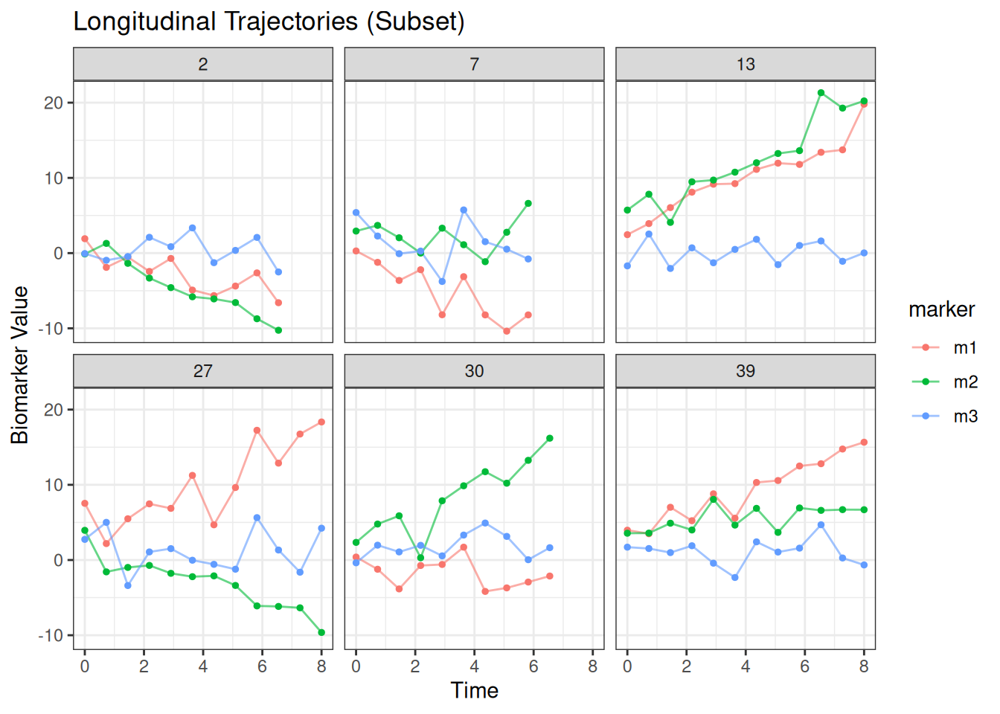
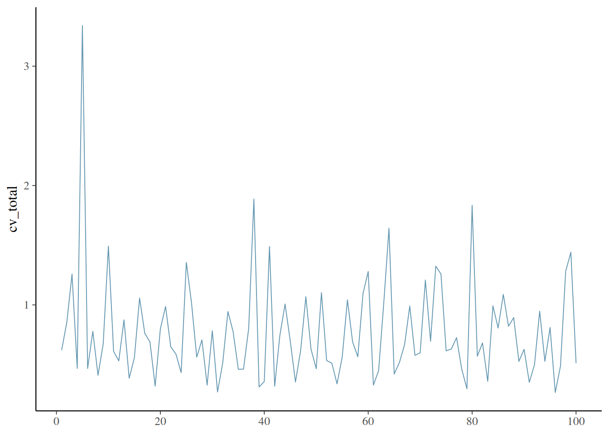
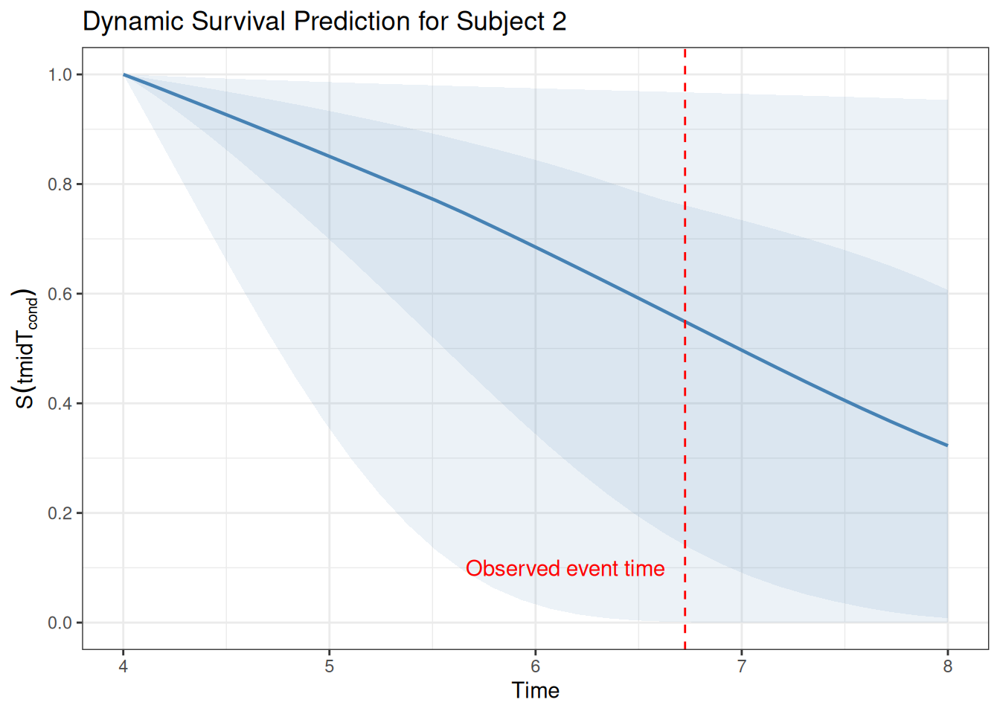
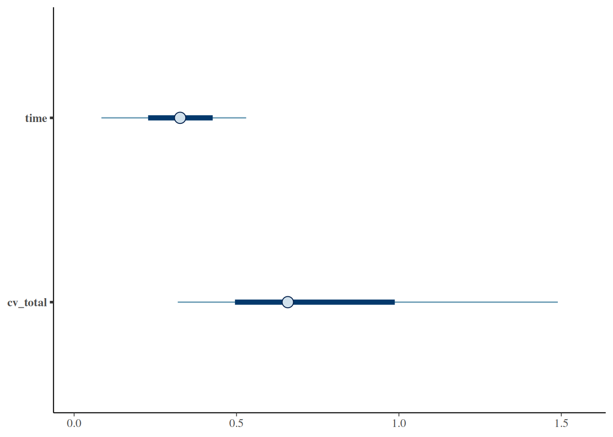

# A Example Workflow for Joint Modelling with mutlivariate Longitudinal and Survival Data using joinme

This vignette outlines a workflow for using `joinme` in a research
context, suitable for inclusion in high-impact statistical or clinical
journals.

## 1 Simulation and Data Exploration

We use the built-in generalised simulator `simulate_joinme` to generate
a dataset where the hazard depends on the “Total Current Value” of the
biomarkers.

Code

``` r

set.seed(2025)

# Simulate a dataset: 
# - 100 subjects
# - 3 biomarkers
# - ~10 observations per marker per subject
sim <- simulate_joinme(
  n_id = 40,
  families = list(
    jm_family("student_t"),
    jm_family("student_t"),
    jm_family("student_t", inv_link = ~ inv_logit(x / 2))
  ),
  times_obs = seq(0, 8, length.out = 12),
  quadrature_nodes = 31,
  assoc = c("cv_total"),
  truth = jm_truth(
    longitudinal = c("(Intercept)" = 1.0, "time" = 0.5, "x1" = 0.4),
    assoc_coef = list(slope = c(cv_total = 0.5)),
    marker_weights = list(family = "student_t")
  )
)

dataLong <- sim$dataLong
dataEvent <- sim$dataEvent

# Optional: generate counting-process event rows with delayed entry.
sim_split <- simulate_joinme(
  n_id = 20,
  formulaEvent = survival::Surv(time_start, time_stop, event) ~ x1 + x2,
  covariate_formulas = list(
    x1 ~ time_varyring(rnorm, c(2, 5), mean = 0, sd = 1),
    x2 ~ rnorm(n_id)
  ),
  left_truncation_max = 1.0,
  seed = 2026
)
dataEvent_split <- sim_split$dataEvent

# Preview the data
head(dataLong)
#>   id marker      time         x1        x2           y
#> 1  1     m1 0.0000000 -0.2942841 0.1433918   1.3791262
#> 2  1     m1 0.7272727 -0.2942841 0.1433918   0.4382883
#> 3  1     m1 1.4545455 -0.2942841 0.1433918  -6.8923800
#> 4  1     m1 2.1818182 -0.2942841 0.1433918  -5.8036282
#> 5  1     m1 2.9090909 -0.2942841 0.1433918 -10.3008172
#> 6  1     m2 0.0000000 -0.2942841 0.1433918   2.4242141
head(dataEvent)
#>   id         x1         x2     time event time_start time_stop
#> 1  1 -0.2942841  0.1433918 3.517974     1          0  3.517974
#> 2  2 -0.5631947  0.7502855 6.725064     1          0  6.725064
#> 3  3  0.3776016 -0.1379869 6.560833     1          0  6.560833
#> 4  4 -0.1430829  0.6646221 8.000000     0          0  8.000000
#> 5  5  0.2235321 -1.0430229 2.860254     1          0  2.860254
#> 6  6  0.4042901  0.5142336 8.000000     0          0  8.000000
```

[`jm_truth()`](https://trinhdhk.github.io/joinme/reference/joinme_truth.md)
describes the data-generating population;
[`jm_priors()`](https://trinhdhk.github.io/joinme/reference/joinme_priors.md)
describes the probability distributions used in fitting. They share
scientific component names but are not interchangeable. A numerical
value in
[`jm_truth()`](https://trinhdhk.github.io/joinme/reference/joinme_truth.md)
is fixed for the whole data set; a `prior_*()` declaration is sampled
once and its realised value is stored in `sim$truth`. The truth object
also contains `basehaz`, `assoc_coef`, and `re_params`. If an ordinary
random-effect standard deviation is omitted, it is drawn once from
`Exponential(1)`. If its correlation matrix is omitted, it is drawn once
from the LKJ distribution declared by `lkj = prior_lkj(...)`.

Visualise your longitudinal trajectories and survival distribution
before modelling.

Code

``` r

# Visualise trajectories for a subset of IDs
subset_ids <- base::sample(unique(dataLong$id), 6)

ggplot(dataLong %>% filter(id %in% subset_ids), aes(x = time, y = y, color = marker, group = marker)) +
  geom_line(alpha = 0.6) +
  geom_point(size = 1) +
  facet_wrap(~id) + 
  theme_bw() +
  labs(title = "Longitudinal Trajectories (Subset)", x = "Time", y = "Biomarker Value")
```



Code

``` r


# Check event rate
table(dataEvent$event)
#> 
#>  0  1 
#> 25 15
prop.table(table(dataEvent$event))
#> 
#>     0     1 
#> 0.625 0.375
```

## 2 Model Specification

We specify a joint model where: 1. **Longitudinal Submodel**: Linear
growth over time with random intercepts and slopes for each
subject-marker combination. 2. **Survival Submodel**: The hazard depends
on baseline covariates (`x1`, `x2`) and the current value (`cv_total`)
of the biomarkers.

#### 2.0.1 Families and distributional regression

Each marker can follow a distinct family (for example Gaussian,
Student-t, Poisson, negative binomial, Bernoulli, beta, or ordinal).
When a family includes additional parameters (for example \sigma, \nu,
or \phi), those parameters can be modelled through `formulaDist`. This
allows heteroscedasticity or covariate-dependent dispersion while
keeping the mean structure aligned across markers.

#### 2.0.2 Association transformations

The association terms can be transformed using identity, a user-defined
mathematical expression, monotone I-splines, or ordered piecewise-linear
interpolation.

### 2.1 Marker-only random effects (no inner id term)

In some studies, marker-level random effects may be required without
subject-specific marker departures. Omit the inner `( ... | id )` term
inside the marker block. Because `corr` and `vcov` describe the
covariance of those subject-specific marker departures, they are
unavailable in this model.

Code

``` r

# Marker-only random effects: no inner ( ... | id )
formulaLong_marker_only <- y ~ time + x1 +
  (1 + time || id) +
  (0 + x1 || marker)
```

Prior families are declared by model block through
[`jm_priors()`](https://trinhdhk.github.io/joinme/reference/joinme_priors.md).
Thus changing the prior for an association coefficient does not silently
change the fixed effects, affine transformation shifts, marker effects,
or marker weights.

Code

``` r

# Define explicit, block-specific priors for transparency.
priors <- jm_priors(
  intercept = prior_student_t(df = 6, mu = 0, scale = 2),
  slope = prior_normal(mu = 0, scale = 1),
  longitudinal = list(
    slope = prior_normal(
      mu = list(0, 0),
      scale = list(1, 0.5)
    )
  ),
  assoc = list(slope = prior_student_t(df = 4, mu = 0, scale = 1)),
  functional = list(slope = prior_laplace(mu = 0, scale = 0.75)),
  marker = list(family = prior_normal()),
  marker_weights = list(
    offset = c(m1 = 0, m2 = 0, m3 = 0),
    intercept = prior_normal(mu = 0, scale = 0.75),
    family = "student_t"
  ),
  lkj = prior_lkj(2)
)
```

The global `intercept` and `slope` declarations are inherited by every
ordinary regression component unless that component replaces the named
role. Numeric vectors and lists of scalar numbers are equivalent.
Partial recycling is refused: a non-scalar declaration must have exactly
the dimension of that component and role after the formula has been
parsed.

When `formulaDist` contains family-scoped regressions, the matching
prior may use the same scope. Because it is an argument name, quote it
with backticks:

Code

``` r

scoped_priors <- jm_priors(
  `sigma[family='student']` = list(
    intercept = prior_student_t(df = 4, scale = 1),
    slope = prior_normal(scale = 0.25)
  )
)
```

## 3 Model Fitting

We fit the model using Hamiltonian Monte Carlo (HMC) via Stan. By
default, `joinme` prefers `cmdstanr` if compiled, otherwise it falls
back to `rstan`. The control parameters can be adjusted using `cmdstanr`
syntax.

Code

``` r

has_cmdstan <- requireNamespace("cmdstanr", quietly = TRUE) &&
  !is.null(tryCatch(cmdstanr::cmdstan_version(error_on_NA = FALSE), error = function(e) NULL))
engine <- if (has_cmdstan) "cmdstanr" else "rstan"

control <- list(
  engine = engine,
  chains = 1,           # Use 4 chains for publication
  iter_warmup = 100,    # Typically 1000+
  iter_sampling = 100,  # Typically 1000+
  parallel_chains = 1,
  adapt_delta = 0.8,   # Increase if divergences occur
  max_treedepth = 12
)

fit <- joinme(
  dataLong = dataLong,
  dataEvent = dataEvent,
  # Longitudinal formula: Fixed effects + Random effects
  formulaLong = y ~ time + x1 + (1 + time || id) + (0 + x1 + (1 + time || id) || marker),
  # Survival formula: Baseline covariates
  formulaEvent = survival::Surv(time, event) ~ x1 + x2,
  # Association structure: Link hazard to the total current value of markers
  assoc = c("cv_total"),
  transforms = joinme_tf(cv_total = "identity"),
  priors = priors,
  control = control
)
#> 
#> SAMPLING FOR MODEL 'joinme_fit_threading' NOW (CHAIN 1).
#> Chain 1: 
#> Chain 1: Gradient evaluation took 0.005867 seconds
#> Chain 1: 1000 transitions using 10 leapfrog steps per transition would take 58.67 seconds.
#> Chain 1: Adjust your expectations accordingly!
#> Chain 1: 
#> Chain 1: 
#> Chain 1: WARNING: There aren't enough warmup iterations to fit the
#> Chain 1:          three stages of adaptation as currently configured.
#> Chain 1:          Reducing each adaptation stage to 15%/75%/10% of
#> Chain 1:          the given number of warmup iterations:
#> Chain 1:            init_buffer = 15
#> Chain 1:            adapt_window = 75
#> Chain 1:            term_buffer = 10
#> Chain 1: 
#> Chain 1: Iteration:   1 / 200 [  0%]  (Warmup)
#> Chain 1: Iteration: 100 / 200 [ 50%]  (Warmup)
#> Chain 1: Iteration: 101 / 200 [ 50%]  (Sampling)
#> Chain 1: Iteration: 200 / 200 [100%]  (Sampling)
#> Chain 1: 
#> Chain 1:  Elapsed Time: 26.033 seconds (Warm-up)
#> Chain 1:                980.357 seconds (Sampling)
#> Chain 1:                1006.39 seconds (Total)
#> Chain 1:

# Counting-process fit with left truncation/time-split covariates:
fit_split <- joinme(
  dataLong = sim_split$dataLong,
  dataEvent = dataEvent_split,
  formulaLong = y ~ time + x1 + (1 + time || id) + (0 + x1 + (1 + time || id) || marker),
  formulaEvent = survival::Surv(time_start, time_stop, event) ~ x1 + x2,
  assoc = c("cv_total"),
  control = control
)
#> 
#> SAMPLING FOR MODEL 'joinme_fit_threading' NOW (CHAIN 1).
#> Chain 1: 
#> Chain 1: Gradient evaluation took 0.010632 seconds
#> Chain 1: 1000 transitions using 10 leapfrog steps per transition would take 106.32 seconds.
#> Chain 1: Adjust your expectations accordingly!
#> Chain 1: 
#> Chain 1: 
#> Chain 1: WARNING: There aren't enough warmup iterations to fit the
#> Chain 1:          three stages of adaptation as currently configured.
#> Chain 1:          Reducing each adaptation stage to 15%/75%/10% of
#> Chain 1:          the given number of warmup iterations:
#> Chain 1:            init_buffer = 15
#> Chain 1:            adapt_window = 75
#> Chain 1:            term_buffer = 10
#> Chain 1: 
#> Chain 1: Iteration:   1 / 200 [  0%]  (Warmup)
#> Chain 1: Iteration: 100 / 200 [ 50%]  (Warmup)
#> Chain 1: Iteration: 101 / 200 [ 50%]  (Sampling)
#> Chain 1: Iteration: 200 / 200 [100%]  (Sampling)
#> Chain 1: 
#> Chain 1:  Elapsed Time: 63.009 seconds (Warm-up)
#> Chain 1:                159.806 seconds (Sampling)
#> Chain 1:                222.815 seconds (Total)
#> Chain 1:
```

## 4 Convergence Diagnostics

We use the `posterior` and `bayesplot` packages to inspect the MCMC
chains.

### 4.1 R-hat and Effective Sample Size

Values of \hat{R} \< 1.01 and ESS \> 400 indicate reasonable convergence
for inference, as recommended by Stan developers.

Code

``` r

# robust summary of regression coefficients on the renamed user-facing scale
draws_obj <- posterior_draws(fit, format = "draws_array")

draws_sub <- posterior::subset_draws(
  draws_obj,
  variable = c("^(Intercept)", "^time$", "^event", "^cv_total"),
  regex = TRUE
)

posterior::summarise_draws(
  draws_sub,
  default_summary_measures(),
  default_convergence_measures()
)
#> # A tibble: 2 × 10
#>   variable  mean median    sd   mad     q5   q95  rhat ess_bulk ess_tail
#>   <chr>    <dbl>  <dbl> <dbl> <dbl>  <dbl> <dbl> <dbl>    <dbl>    <dbl>
#> 1 time     0.320  0.326 0.143 0.149 0.0840 0.530 1.01      115.     78.3
#> 2 cv_total 0.770  0.658 0.439 0.292 0.319  1.49  0.991     139.    102.
```

### 4.2 Traceplots

Visual inspection of traceplots helps identify mixing issues or stuck
chains. Note that the marker-specific association term for the first
association (if marker weights are shared) is forced to be positive. If
`marker_weights$shared` is `FALSE`, then the marker-specific association
terms are all constrained to be positive.

Code

``` r

# Plot traces for the association parameter using the helper API
mcmc_plot(fit, variable = "cv_total", type = "trace")
```



## 5 Dynamic Prediction

One of the most powerful features of joint models is **dynamic
prediction**: updating survival probabilities as new biomarker data
becomes available.

If competing risks are present, the dynamic survival and cumulative
hazard outputs correspond to the overall survival that integrates the
sum of cause-specific hazards. Cause-specific survival curves are not
returned by the default prediction outputs.

We select a subject who had an event at a later time and predict their
survival probability conditionally on data observed up to an earlier
time point.

Code

``` r

# Select a subject with an event > 5
target_id <- dataEvent$id[which(dataEvent$time > 5 & dataEvent$event == 1)[1]]
if (is.na(target_id)) target_id <- dataEvent$id[1]

# Define the conditioning time (time_start)
t_cond <- 4

# You can also pass a column name in newdataEvent, e.g. time_start = "time_start".

# Filter history up to t_cond
ndLong <- dataLong |> filter(id == target_id, time <= t_cond)
ndEvent <- dataEvent |> filter(id == target_id)

print(paste("Predicting for ID:", target_id, "conditioned on history up to t =", t_cond))
#> [1] "Predicting for ID: 2 conditioned on history up to t = 4"
```

Run the prediction:

Code

``` r

# Predict conditional survival from t_cond onwards
preds <- tryCatch(
  predict(
    fit,
    newdataLong = ndLong,
    newdataEvent = ndEvent,
    time_start = t_cond,
    times = seq(t_cond, 8, length.out = 30),
    process = "event", # Focus on survival and cumhaz
    control = list(progress = FALSE) # just to silence the progress bar
  ),
  error = function(e) {
    message("Prediction skipped: ", conditionMessage(e))
    NULL
  }
)

head(preds$predictions$survival)
#>     id     time  Survival    Median  Est.Error       L95       U95
#> 2.1  2 4.000000 1.0000000 1.0000000 0.00000000 1.0000000 1.0000000
#> 2.2  2 4.137931 0.9716349 0.9803110 0.02763955 0.9065650 0.9978418
#> 2.3  2 4.275862 0.9423368 0.9598085 0.05587747 0.8123380 0.9957610
#> 2.4  2 4.413793 0.9122360 0.9393903 0.08442012 0.7184409 0.9937528
#> 2.5  2 4.551724 0.8814960 0.9187693 0.11293141 0.6261259 0.9918227
#> 2.6  2 4.689655 0.8503127 0.8979580 0.14104076 0.5367392 0.9899672
```

When the identifier occurred during fitting, the posterior random
effects can be reused directly. This targets a fitted-subject
conditional prediction and avoids estimating another set of effects from
the same history:

Code

``` r

fitted_subject_prediction <- posterior_epred(
  fit,
  newdataLong = ndLong,
  newdataEvent = ndEvent,
  process = c("longitudinal", "event"),
  times = seq(t_cond, 8, length.out = 30),
  reuse_fitted_re = TRUE
)
```

The identifier is matched to the fitted subject index. An unseen
identifier is rejected; dynamic prediction for a new subject uses
`reuse_fitted_re = FALSE`.`posterior_linpred()` and
`posterior_predict()` accept the same argument.

Conditional effects and contrasts can use the same subject-conditional
estimand by placing the fitted identifier in `conditions`. Both contrast
profiles deliberately share that identifier:

Code

``` r

conditional_effects(
  fit,
  effects = "time",
  conditions = data.frame(id = target_id),
  process = "longitudinal",
  reuse_fitted_re = TRUE
)

conditional_contrast(
  fit,
  groupA = c(treatment = "active"),
  groupB = c(treatment = "control"),
  conditions = data.frame(id = target_id, time = seq(0, 8, length.out = 40)),
  process = "longitudinal",
  reuse_fitted_re = TRUE
)
```

Both conditional interfaces can retain the posterior calculation before
it is summarised. This is useful for posterior probabilities, nonlinear
functions of a contrast, or bespoke figures whose uncertainty must be
propagated draw by draw:

Code

``` r

effect_draws <- conditional_effects(
  fit,
  effects = "time",
  process = "longitudinal",
  summary = FALSE
)

time_draws <- effect_draws$longitudinal$time

contrast_draws <- conditional_contrast(
  fit,
  groupA = c(treatment = "active"),
  groupB = c(treatment = "control"),
  conditions = data.frame(time = seq(0, 8, length.out = 40)),
  process = "longitudinal",
  summary = FALSE
)

time_contrast_draws <- contrast_draws$longitudinal
```

`concordance(fit)` is a follow-up-wide survival-curve concordance rather
than a ROC analysis at one selected horizon. By default, residual
follow-up for subject i starts at their final longitudinal measurement
strictly before the observed event or censoring time, T\_{0i}. For an
event at residual time r_i=T_i-T\_{0i}, the event subject is compared
with every subject known to survive longer. The pair is concordant when
\widehat S_i(r_i)\<\widehat S_j(r_i): both conditional survival curves
are evaluated at the same earlier event time. This is the survival-curve
concordance proposed by Antolini and colleagues and does not use the
outcome time to construct a fixed subject score.

Premature censoring is handled through observability. A subject censored
before r_i is not comparable with that event; censoring at r_i
establishes survival through that time and remains comparable.
`type_weights = "n/G2"` requests Uno’s inverse-censoring weighting
through
[`survival::concordance()`](https://rdrr.io/pkg/survival/man/concordance.html).
Fitted monotone splines and ordered piecewise-linear associations enter
every curve through their posterior ordinates.

Code

``` r

concordance(fit)
concordance(fit, time_start = 2, type_weights = "n/G2")
roc <- tvROC(
  fit,
  time_start = 2,
  time_horizon = 5,
  type_weights = "model-based"
)
plot(roc)
tvAUC(roc)
```

Finally, we visualise the predicted survival curve. The shaded area
represents the 95% credible interval, accounting for uncertainty in both
the parameters and the random effects.

Code

``` r

if (!is.null(preds)) {
  survival_plot(preds) +
    ggtitle(paste("Dynamic Survival Prediction for Subject", target_id)) +
    geom_vline(xintercept = dataEvent$time[dataEvent$id == target_id], linetype = "dashed", color = "red") +
    annotate("text", x = dataEvent$time[dataEvent$id == target_id], y = 0.1, label = "Observed event time", color = "red", hjust = 1.1)
}
```



## 6 Posterior draws and visualisation

[`posterior_draws()`](https://trinhdhk.github.io/joinme/reference/posterior_draws.md)
and
[`mcmc_plot()`](https://trinhdhk.github.io/joinme/reference/mcmc_plot.md)
use the same parameter names as `summary(fit)`.

Code

``` r

renamed_draws <- posterior_draws(fit, variables = c("time", "cv_total"), format = "draws_df")
head(renamed_draws)
#> # A draws_df: 6 iterations, 1 chains, and 2 variables
#>      time cv_total
#> 1  0.5131     0.62
#> 2 -0.0038     0.85
#> 3  0.6096     1.26
#> 4  0.1803     0.47
#> 5  0.4196     3.34
#> 6  0.2498     0.47
#> # ... hidden reserved variables {'.chain', '.iteration', '.draw'}

mcmc_plot(fit, variable = c("time", "cv_total"), type = "intervals")
```



The plotting wrappers expose the same fitted and predicted views as the
main [`plot()`](https://rdrr.io/r/graphics/plot.default.html) methods
while making the intent explicit in scripts and reports:

Code

``` r

longitudinal_plot(fit, subject = 1, scale = "epred")
association_plot(fit)
diagnostic_plot(fit, type = "ess_bulk")

if (!is.null(preds)) {
  longitudinal_plot(preds)
  survival_plot(preds)
  cumhaz_plot(preds)
}
```

For fitted longitudinal displays, the heatmap is an alternative to the
usual separated marker curves:

Code

``` r

plot(
  fit,
  type = "longitudinal",
  longitudinal_style = "heatmap",
  scale = "epred",
  threshold = 0.05
)
```

`plot(fit, ...)` uses fitted posterior samples directly and does not
accept a conditioning argument. Named covariate profiles belong to the
conditional- effects estimand. Build those profiles with
[`make_conditions()`](https://trinhdhk.github.io/joinme/reference/make_conditions.md)
and pass them to `conditional_effects()`:

Code

``` r

profiles <- make_conditions(dataEvent, vars = c("x1", "x2"))

effects_data <- conditional_effects(
  fit,
  effects = list(
    longitudinal = "time",
    event = c("x1", "x2")
  ),
  conditions = profiles,
  process = c("longitudinal", "event"),
  longitudinal_estimand = "population",
  plot = FALSE
)

plot(effects_data, ask = FALSE)
```

The longitudinal calculation has three estimands. `"population"` uses
only the fixed-effect contribution, evaluates that contribution under
every selected marker’s inverse link, and averages the resulting
trajectories within each posterior draw. `"marker"` adds the fitted
marker-level deviation and retains a separate trajectory for every
selected marker, whilst still excluding subject and marker-by-subject
deviations. `"marginal_marker"` adds the marker-level deviation,
calculates each selected marker response, and averages those responses
within every posterior draw. Population and marker-marginal results
therefore contain one trajectory per condition; only `"marker"` produces
marker-specific curves. Applying the inverse link before averaging is
important for nonlinear links: it estimates the average expected
response rather than the expected response at an average marker effect.
The `markers` argument restricts the equally weighted set entering
either average, or the panels retained by the marker-specific estimand.

Code

``` r

average_marker_effect <- conditional_effects(
  fit,
  effects = "time",
  process = "longitudinal",
  longitudinal_estimand = "marginal_marker",
  markers = c("m1", "m2"),
  plot = FALSE
)
```

The event tables contain the covariate-specific relative hazard
`exp(W * gamma)`, holding the baseline hazard and longitudinal
association contribution fixed.

A paired comparison of two covariate profiles is obtained with
[`conditional_contrast()`](https://trinhdhk.github.io/joinme/reference/conditional_contrast.md).
This differs from subtracting two rows of a printed conditional-effects
table: predictions for A and B are paired within each MCMC draw, the
contrast is formed, and only that posterior contrast is summarised.

Code

``` r

contrast_conditions <- data.frame(
  time = seq(0, max(dataLong$time), length.out = 60),
  x2 = 0,
  cond__ = paste0("time=", round(seq(0, max(dataLong$time), length.out = 60), 2))
)

profile_contrast <- conditional_contrast(
  fit,
  groupA = list(x1 = 1),
  groupB = list(x1 = -1),
  conditions = contrast_conditions,
  process = c("longitudinal", "event"),
  method = "posterior_epred",
  longitudinal_estimand = "marginal_marker",
  event_scale = "hazard_ratio",
  plot = FALSE
)

plot(profile_contrast, condition_variable = "time", ask = FALSE)
```

Longitudinal contrasts are differences, A minus B, on the selected
scale. Event contrasts are hazard ratios, A divided by B, unless the
log-hazard-ratio scale is requested. Group assignments override matching
columns in `conditions`; all remaining predictors use the condition
value or their reference value from the fitting data.
