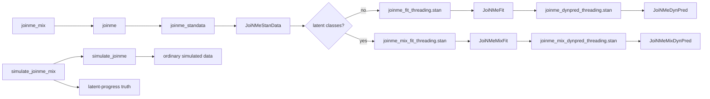
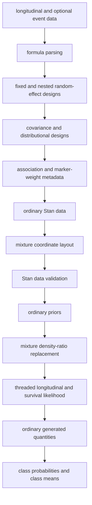
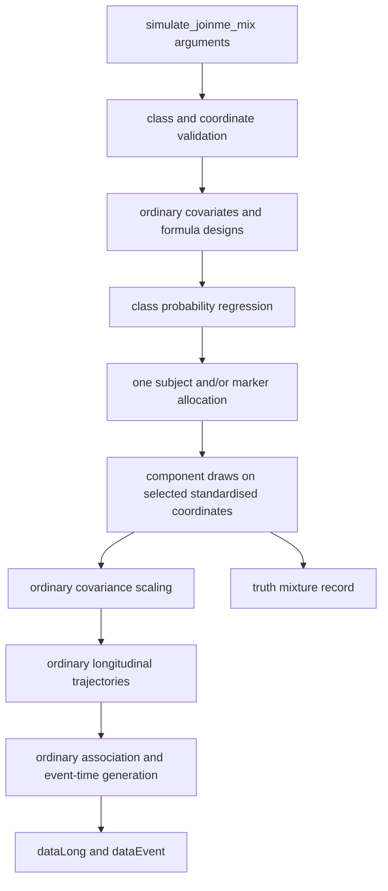
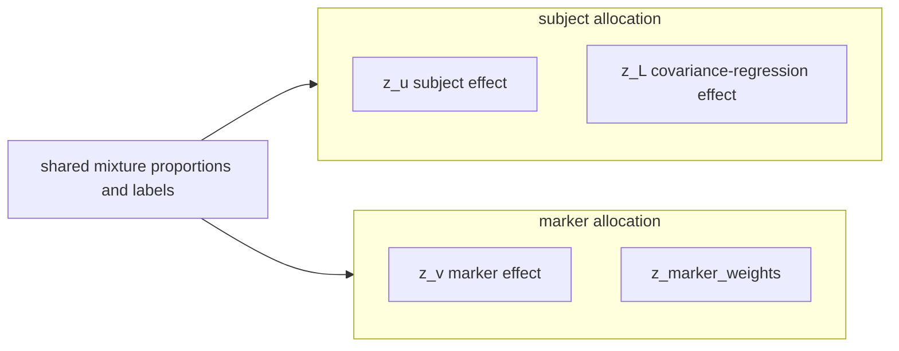
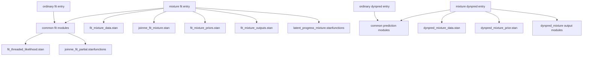
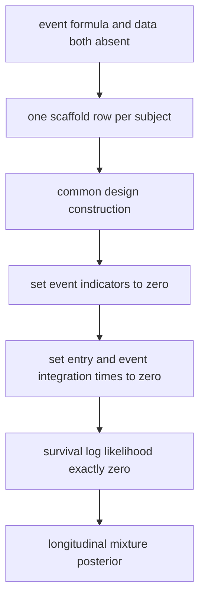

# JoiNMe architecture

This note describes the current package architecture, including the
latent-progress mixture fitted by `joinme_mix()`. It is an implementation map,
not a substitute for the statistical vignettes.

## Public entry points



`joinme()` is the ordinary model entry point. It accepts either a complete
survival formula--data pair or neither event argument. In the latter case,
`.longitudinal_only_event_scaffold()` supplies one administrative, event-free
row per subject and `include_survival = 0` removes every event likelihood
contribution. This retains a single design and sampling pathway whilst the
returned configuration records that only the nested longitudinal model was
fitted.

`joinme_mix()` is a
separate public entry point because a mixture changes the prior distribution,
posterior output and interpretation. It nevertheless delegates ordinary design
construction and sampling control to `joinme()`. Immediately before
compilation, `.stan_fit_program()` routes ordinary and mixture data to
different Stan entry points. `.stan_dynpred_program()` applies the same rule to
prediction.

`simulate_joinme()` and `simulate_joinme_mix()` form the corresponding
generative pair. The mixture simulator has the formula, family, marker-weight
and class arguments used by `joinme_mix()`, plus the ordinary simulator's
generative coefficient controls. It delegates to `simulate_joinme()` through a
private mixture specification. Thus there is one implementation of response
sampling, distributional regression, censoring, delayed entry, baseline
hazards, association transformations and event-time generation.

`joinme_standata()` is the single fit-data builder. Its internal `mixture`
argument is `NULL` for an ordinary model and receives a checked specification
from `joinme_mix()`. Ordinary fits receive:

```text
use_mixture = 0
n_classes       = 1
K_mix       = 0
```

Those fields remain useful R-side metadata, but the ordinary Stan programme
does not declare or receive them. The final data filter is derived from the
selected programme, so mixture arrays are absent from ordinary Stan input.

## R source responsibilities

### `R/fit.R`

- validates ordinary fit controls;
- distinguishes joint and longitudinal-only fits and constructs the neutral
  event scaffold when required;
- calls `joinme_standata()`;
- identifies the Stan programme and engine;
- constructs `id_start`, `id_end`, and `grainsize`;
- removes R-only metadata from sampling data;
- samples through the common `JoiNMeStanData` holder.

The fit path calls `.coerce_rstan_mixture_data()` before applying the selected
programme's data contract. This preserves mixture index shapes where required,
while ordinary fitting discards those fields before sampling.

### `R/standata.R`

- parses fixed, subject, marker and nested subject-by-marker terms;
- builds observation, event and quadrature designs;
- builds covariance-regression and distributional-regression data;
- resolves association channels and marker-weight sets;
- records `include_survival` and zeros event integration limits, indicators,
  and censoring codes for longitudinal-only fits;
- appends `.build_mixture_standata()` output.

For a longitudinal-only mixture, the outer builder sets event indicators and
integration times to zero after all common designs have been created.

### `R/mix.R`

- defines and documents `joinme_mix()`;
- validates paired event inputs;
- builds a likelihood-neutral event scaffold when survival is absent;
- validates the four public class types;
- resolves progress-plane coordinate indices;
- lays selected coordinates into one common component vector;
- builds component priors and R reporting metadata;
- marks the common Stan-data holder so sampling returns `JoiNMeMixFit`.

`.canonical_class_types()` deliberately accepts only:

```text
subject
marker
corr
vcov
```

### `R/simulate-mix.R`

- defines and documents `simulate_joinme_mix()`;
- preserves the ordinary `simulate_joinme()` call syntax;
- validates `n_classes`, `formulaClass`, `class_type`,
  `class_dimensions`, and `class_ordering` through the fitting helpers;
- reuses `.build_mixture_standata()` to obtain the exact fitting coordinate
  layout;
- resolves fixed generative class probabilities, regression coefficients,
  locations and scales;
- evaluates subject- and marker-domain class probabilities;
- samples one allocation per natural allocation unit;
- replaces selected standardised latent coordinates with
  component-conditional draws; and
- records complete generative truth without adding class labels to observed
  datasets.

### `R/simulate.R`

The ordinary simulation engine owns every common generative calculation. A
private `.mixture_specification` is `NULL` for `simulate_joinme()` and is
populated only by `simulate_joinme_mix()`. Three deliberately narrow hooks
apply the prepared mixture:

```text
subject          -> z_id before the L_u covariance factor
marker           -> z_marker before the L_v covariance factor
corr/vcov        -> selected canonical z_cov coordinates before covariance regression
```

For covariance regression, coordinate \(m\) corresponds to one packed
lower-triangular entry. Stan stores `lambda_L` as a vector with one
non-negative scalar `lambda_L[m]` per coordinate. Its action is diagonal:
`diag_matrix(lambda_L) * z_L[i]`. It is not a dense loading matrix and cannot
move latent coordinate \(m\) into another covariance coordinate. Diagonal
coordinates are subsequently mapped through the selected positive link;
off-diagonal coordinates are mapped through `tanh` and the row-wise
partial-correlation reconstruction.

No response or event likelihood is duplicated. The simulator exposes
`truth$mixture$standardised_draws` because this is the scale on which Stan
defines the fitted component density.

### `R/r6.R`

The existing R6 hierarchy remains the storage layer:

```text
JoiNMeFit
└── JoiNMeMixFit

JoiNMeDynPred
└── JoiNMeMixDynPred
```

`JoiNMeStanData` has two small routing fields:

- `result_class`, either `"standard"` or `"mixture"`;
- `result_metadata`, holding the checked mixture description.

Its existing `sample()` method chooses the fitted subclass after sampling.

### `R/mix-methods.R`

- class-probability extraction through `posterior_class()`;
- augmented `summary()` and print methods;
- inherited prediction wrapped as `JoiNMeMixDynPred`;
- class-centre and marginal longitudinal plots;
- class-specific covariance-regression plots;
- class-specific association trajectories and compact posterior association
  tables only when the fitted class block changes that association source;
- survival-method guards for longitudinal-only fits.

Methods which need no mixture-specific calculation continue to dispatch to the
parent class. This includes posterior predictive checking, draw extraction,
random-effect summaries, MCMC plots and model diagnostics.

The augmented summary retains unique Stan variable names as internal keys and
uses scientific labels only for display. This separation is essential because
the same covariate and random-effect coordinate labels recur in several
classes. A positional one-to-one match attaches R-hat and effective sample
sizes to each variable; joining on repeated display labels would multiply rows
and incorrectly repeat the first class estimate.

Mixture output is divided into baseline probabilities, standardised latent
locations, standardised within-class scales, class-membership regression, and
a compact posterior distribution of expected allocation counts. Means,
medians, standard deviations and both central interval limits occupy distinct
numeric columns. Full unit-by-class probabilities remain the responsibility
of `posterior_class()`. The hard maximum-probability allocation count is
retained beside each soft count distribution. Headline
diagnostic extrema include all sampler variables, and displayed-parameter
threshold counts include the mixture tables.

`diagnosis.JoiNMeMixFit()` additionally reads the retained sampler-state array
from either backend. It reports E-BFMI, energy lag-one correlation, tree depth,
leapfrog count, acceptance and step size by chain. It then aligns posterior and
sampler iterations to calculate exploratory energy associations. A separate
scale-trade-off table compares the logarithmic geometric mean of each selected
ordinary scale (`tau_u`, `tau_v`, or `lambda_L`) with the corresponding
`mix_scale` block. This makes the unanchored likelihood ridge visible without
changing the fitted statistical model.

## Statistical data flow



The mixture does not modify observation rows or the longitudinal linear
predictor. It modifies only the prior distribution of selected standardised
random-effect coordinates.

## Mixture simulation data flow



The class allocation is generated before the response and event processes but
is not copied into either observed data table. For a combined
`c("subject", "vcov")` request, `E` contains one subject allocation vector.
The `"marker"` type has one marker allocation vector.

The component family is selected by `shrinkage`, exactly as in the fitted
mixture. Unselected subject, marker and covariance-regression coordinates
retain standard Normal draws. Unselected estimated marker weights retain the
ordinary Student-\(t_6\), Laplace or Normal shrinkage draw.

The truth record contains:

```text
n_classes
levels, dimensions, starts, total_dimension
ordering, ordered_location_coordinate
probability, coefficient, probability_by_unit
allocation, allocation_domains
location, scale, distribution
class_design
standardised_draws
```

Fitted-scale aliases are also placed in `truth$stan_fit` under
`mix_probability`, `mix_location`, `mix_scale`,
`mix_class_coefficient_subject`, and
`mix_class_coefficient_marker`.

## Mixture coordinate layout

The R builder uses a fixed block order:

```text
subject -> marker -> corr/vcov
```

For each block it sends:

- an active flag;
- the number of selected coordinates;
- the original block-coordinate indices;
- a one-based start position in the common component vector.

An inactive block has dimension zero, an empty index array, and start zero.

Suppose the request is:

```r
class_type = c("subject", "vcov")
class_dimensions = list(
  subject = c(1, 2),
  vcov = c(1, 3)
)
```

Then:

```text
K_mix                 = 4
mix_idx_subject    = [1, 2]
mix_start_subject  = 1
mix_idx_covariance    = [1, 3]
mix_start_covariance  = 3
```

There are \(G\) components over a four-coordinate vector. There is no
`expand.grid()` over level-specific labels.

## Natural allocation domains



Within an allocation domain, selected blocks are concatenated within one
component log density. Across domains, the same \(G\) labels and proportions
are used but conditional probabilities are calculated for their own units.

The default ordering uses one `ordered[G]` vector for the first selected
random-intercept coordinate. Every selected slope and other location is held
in an unrestricted matrix. Probability ordering uses positive ordered
additive-log-ratio gaps to produce strictly ordered baseline probabilities.
The `"none"` mode uses an unrestricted simplex and unrestricted locations.

## Stan entry-point and include structure

There are four deliberately thin entry points:

```text
joinme_fit_threading.stan          ordinary fitting
joinme_mix_fit_threading.stan      latent-class fitting
joinme_dynpred_threading.stan      ordinary dynamic prediction
joinme_mix_dynpred_threading.stan  latent-class dynamic prediction
```

The ordinary entry points do not contain latent-class data, parameters,
densities or generated quantities. This is more than a routing distinction:
Stan never parses or generates C++ for the omitted mixture blocks.

Shared threaded calls remain single-source modules:

```text
helper/model/fit_threaded_likelihood.stan
helper/model/dynpred_threaded_likelihood.stan
```



### Mixture data

`helper/data/fit_mixture_data.stan` declares:

- `use_mixture`, `n_classes`, and `K_mix`;
- one flag, dimension, index array and start per class-eligible block;
- `mix_probability_prior`;
- subject and marker `formulaClass` design matrices; and
- the class-regression prior scale.

### Mixture parameters

`helper/parameters/joinme_fit_mixture.stan` declares:

```stan
simplex[n_classes] mix_probability;
array[mix_ordered_location_coordinate > 0 ? 1 : 0]
  ordered[n_classes] mix_location_ordered;
matrix[n_classes, K_mix - (mix_ordered_location_coordinate > 0 ? 1 : 0)]
  mix_location_unordered;
matrix<lower=1e-8>[n_classes, K_mix] mix_scale;
vector[P_class_subject] mix_class_coefficient_subject;
vector[P_class_marker] mix_class_coefficient_marker;
```

This parameter module is never included by the ordinary fitting programme.

### Mixture probability functions

`helper/functions/latent_progress_mixture.stanfunctions` centralises:

- Student-\(t_6\), Laplace and Normal component densities;
- the matching ordinary marker-weight density used as the denominator of the
  density-ratio correction; and
- compact shared or class-specific multinomial-logit calculations for
  `formulaClass`.

The same component evaluator is used in the model and generated quantities.

### Prior replacement

`helper/model/fit_priors.stan` first applies the ordinary JoiNMe priors.
`helper/model/fit_mixture_priors.stan` then:

1. applies priors to component probabilities, ordered locations, scales and
   class-regression coefficients;
2. gathers selected coordinates for one natural allocation unit;
3. subtracts the ordinary selected-coordinate density;
4. adds `log_sum_exp()` of the \(G\) component densities.

Formula-scoped random-effect weights multiply both the removed and replacement
density for the relevant subject or marker.

### Generated quantities

`helper/generated_quantities/fit_mixture_outputs.stan` produces:

- `posterior_class_probability_subject`;
- `posterior_class_probability_marker`;
- convenient maximum-probability labels;
- class locations expanded back to the full dimensions of `z_u`, `z_v`,
  `z_L`, and marker-weight sets.

The discrete labels are summaries. They are not model parameters.

The dynamic programme uses the same component-density helper. Its data block
receives draw-specific fitted component parameters, its model block replaces
the selected dynamic priors by density ratio, and
the `dynpred_mixture_output_*` modules record conditional probabilities for new
subjects and markers. Ordinary and mixture output declarations are split
from their calculations so both entry points can assemble a valid generated
quantities block without copying code.

## Portable transformation-bytecode module

The transformation virtual machine is separated from JoiNMe's formula and
model code:

```text
R/bytecode-interpreter.R
inst/stan/helper/bytecode/interpreter.stanfunctions
inst/stan/helper/bytecode/README.md
```

The R module owns the complete opcode registry, structural validation, legacy
normalisation, scalar evaluation and vector evaluation. It depends only on
base R and `stats`; simulation now reuses it rather than carrying a private
interpreter. `R/transform_map.R` is the JoiNMe-specific compiler and obtains all
instruction numbers from the module registry.

The Stan module implements the same stack protocol and is included directly by
all four entry points. The former
`helper/bytecode/interpreter.stanfunctions` path is retained as a
small compatibility adapter. This boundary allows the interpreter and its
language-neutral protocol to be moved to another package without taking joint
model formula parsing, data construction or fitted classes with it.

## Longitudinal-only control flow



The scaffold preserves the common time scale and identifier mapping. It is
never treated as an observed censoring process because both the exact event
term and cumulative hazard are zero.

## Association flow

The hazard association calculation retains the existing order:

```text
construct mean, marker, total, corr, and vcov raw features
for each marker:
    transform its current-value or current-slope feature
    multiply by the effective marker weight
average over markers
transform/centre covariance features as specified
multiply transformed features by association coefficients
sum into the log hazard
```

Class-specific R plots mirror this structure:

- mean channels use fixed plus subject class effects;
- marker channels use marker class effects and centred nested departures;
- total channels sum the mean and marker parts;
- covariance channels reconstruct the class-specific Cholesky and covariance
  profiles.

## Longitudinal plotting estimands

`mean_per_class` uses component locations for class-specific blocks that enter the
longitudinal location. It is a conditional class-centre curve.

`marginal_per_class` samples from the fitted within-component location--scale
distribution before applying each marker's inverse link. It is therefore on the
response scale and retains posterior and within-class uncertainty.

Covariance classes primarily alter dispersion and covariance; the dedicated curve is
`type = "covariance_class"`.

## Prediction and validation inheritance

`JoiNMeMixFit` inherits the ordinary fit class, so methods use the established
implementation unless a class-specific calculation is needed:

| method | mixture behaviour |
|---|---|
| `summary()` | ordinary tables plus mixture tables |
| `plot()` | ordinary plots plus class plots |
| `predict()` | fitted component priors propagated to new latent effects; mixture subclass retained |
| `pp_check()` | inherited longitudinal check |
| `mcmc_plot()` | inherited, mixture variables selectable |
| `diagnosis()` | inherited diagnostics plus chain-specific energy, scale-trade-off and energy-association tables |
| `concordance()` | inherited for joint fits; guarded for longitudinal-only |
| `tvROC()`, `tvAUC()` | inherited for joint fits; guarded for longitudinal-only |
| `assoc()` | common coefficient output plus relevant class-specific contribution tables and a dense trajectory option |
| `posterior_class()` | fitted-unit and conditional new-unit allocation probabilities, compact printing and interval plotting |

### Dynamic prediction and latent classes

The dynamic Stan programme receives the mixture probability, location and
scale from each retained parent-model draw. It first evaluates the established
conditioning likelihood. A density-ratio correction then removes the ordinary
standard-Normal density from each selected dynamic coordinate and replaces it
with the fitted component mixture.

The allocation convention is unchanged:

- dynamically sampled subject and covariance-regression coordinates share
  one new-subject allocation;
- dynamically sampled marker coordinates and fitted marker-weight latents
  share one allocation per marker;
- both domains use the same \(G\) labels and component parameters, but their
  observational units remain distinct.

Generated quantities calculate the corresponding conditional class
probabilities. R retains these within `draws$posterior_class`;
`posterior_class()` summarises them and
`plot(..., type = "class_membership")` displays their uncertainty. An ordinary
fit supplies one inert component, so this extension does not alter its
prediction distribution.

## Extension points

Future changes should preserve the following boundaries.

1. Add new class-eligible blocks in `.build_mixture_standata()` and the two
   mixture Stan includes, not inside the likelihood reducer.
2. Keep class allocations marginalised.
3. Keep generated probability calculations algebraically identical to the
   model density.
4. Preserve the inert dimensions for ordinary fits.
5. Add class-specific interpretation in `R/mix-methods.R`, while delegating
   ordinary methods to their parent.
6. Test combined levels explicitly to prevent accidental Cartesian expansion.

## Verification map

The focused tests in
`tests/testthat/test-latent-progress-mixture.R` cover:

- inert ordinary-model dimensions;
- shared \(G\) for compatible combined blocks;
- intercept/probability/no-order declarations and compact class-regression data;
- shared and unshared marker-weight coordinate layouts;
- validation of unavailable levels and coordinate indices;
- longitudinal-only scaffolding;
- entry-point routing;
- Stan data-name inclusion;
- zero-length array coercion; and
- covariance reconstruction.

Stan translation should also be run against
`joinme_fit_threading.stan` after any include change. Full posterior behaviour
requires the existing compile-and-fit integration suite and substantive
simulation recovery studies.
