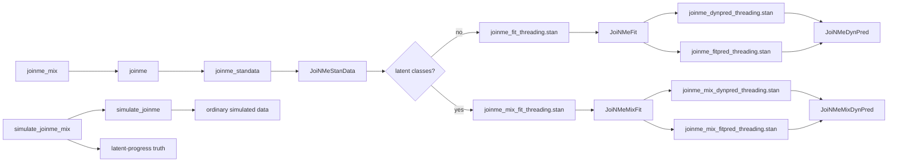
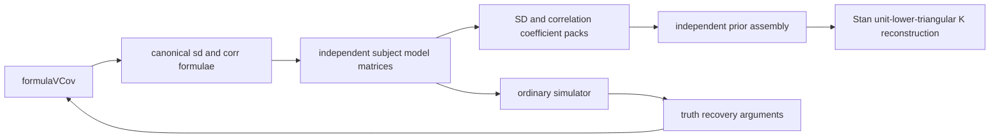
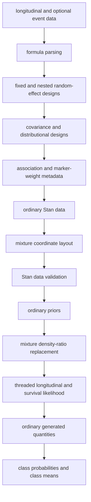
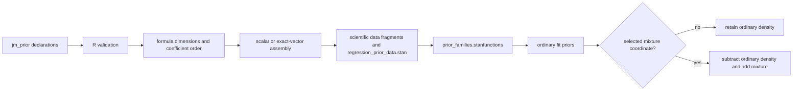
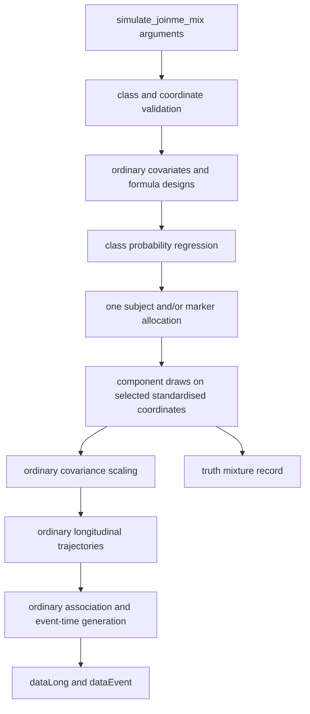
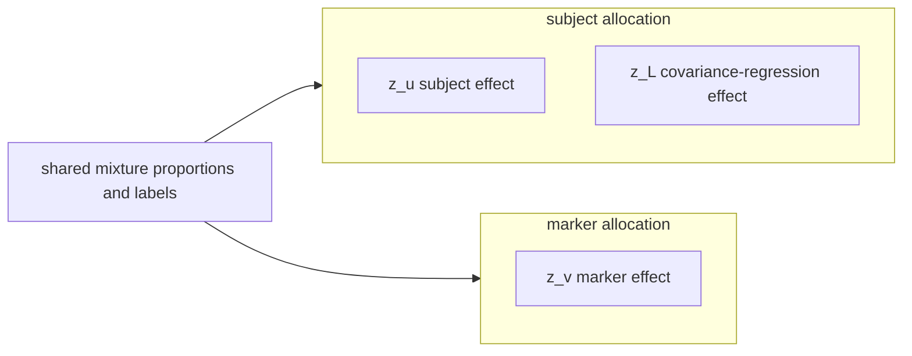
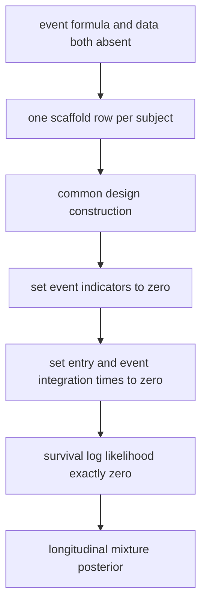

# JoiNMe architecture

This note describes the current package architecture, including the
latent-progress mixture fitted by `joinme_mix()`. It is an implementation map,
not a substitute for the statistical vignettes. Interpretive and manuscript
guidance belongs to
[the reporting note](../joinme-reporting-notes.qmd).

## Public entry points



`joinme()` is the ordinary model entry point. It accepts either a complete
survival formula--data pair or neither event argument. In the latter case,
`.longitudinal_only_event_scaffold()` supplies one administrative, event-free
row per subject and `include_survival = 0` removes every event likelihood
contribution. This retains a single design and sampling pathway whilst the
returned configuration records that only the nested longitudinal model was
fitted.

`joinme_mix()` is a
separate public entry point because a mixture changes the prior distribution,
posterior output and interpretation. It nevertheless delegates ordinary design
construction and sampling control to `joinme()`. Immediately before
compilation, `.stan_fit_program()` routes ordinary and mixture data to
different Stan entry points. `.stan_dynpred_program()` applies the same rule to
prediction.

`simulate_joinme()` and `simulate_joinme_mix()` form the corresponding
generative pair. Both receive population declarations through `jm_truth()`.
The mixture simulator retains the formula, family and class arguments used by
`joinme_mix()` and delegates the common generation to `simulate_joinme()`.
Thus there is one implementation of response sampling, distributional
regression, censoring, delayed entry, baseline hazards, association
transformations and event-time generation.

`joinme_standata()` is the single fit-data builder. Its internal `mixture`
argument is `NULL` for an ordinary model and receives a checked specification
from `joinme_mix()`. Ordinary fits receive:

```text
use_mixture = 0
n_classes       = 1
K_mix       = 0
```

Those fields remain useful R-side metadata, but the ordinary Stan programme
does not declare or receive them. The final data filter is derived from the
selected programme, so mixture arrays are absent from ordinary Stan input.

## Covariance-regression contract



`.get_vcov_formula()` is the sole syntax parser. A formula becomes
`list(sd = formula, corr = formula)`; an explicit list must contain both
components and no additional names. `.build_vcov_design()` then removes each
formula intercept and creates `Xcov_sd`/`K_cov_sd` and
`Xcov_corr`/`K_cov_corr` independently.

Stan packs `vcov_sd` as all SD intercepts followed by row-major SD slopes. It
packs `vcov_corr` as all row-major off-diagonal intercepts followed by their
row-major slopes. The longstanding packed lower-triangle order of `z_L` and
`lambda_L` is unchanged, preserving covariance associations and latent-class
coordinate selection. `simulate_joinme()` uses these same matrices and packs;
its `truth$recovery` record contains a directly reusable `joinme()` or
`joinme_mix()` argument list.

The Stan reconstruction uses an explicit independent decomposition:
`formulaVCov$sd` regresses the marginal scale vector
\(\boldsymbol\sigma_i\), and `formulaVCov$corr` regresses row-wise partial
correlations. A sequential square-root product converts those partial
correlations into the Cholesky correlation factor \(K_i\), whose rows have
unit norm. The final covariance is
\(\Sigma_i=\operatorname{diag}(\boldsymbol\sigma_i)K_iK_i^\top\operatorname{diag}(\boldsymbol\sigma_i)\).

Objects fitted before this split remain readable. `.stored_vcov_design()`
presents their `K_cov`/`Xcov` as a shared SD/correlation design, and reporting,
class plots and prediction draw extraction unpack the former `beta_L` rows
into the new component view. This is a read-only bridge: every newly prepared
fit uses only the split fields and split Stan parameters.

Simulation truth exposes the scientific nested records and fitted-name aliases
(`alpha_L`, `beta_L_sd`, `beta_L_corr`, `lambda_L`, and `z_L`). The former are
suited to interpretation; the latter permit exact posterior-recovery joins
without duplicating the packer in an analysis script.

### Population values at the simulation boundary

`jm_truth()` has the same scientific coefficient hierarchy as `jm_prior()`,
but the two objects have different meanings. A finite numeric value in
`jm_truth()` fixes a population coefficient. A `prior_*()` declaration in
`jm_truth()` is a between-data-set generating distribution: the simulator
draws the required coefficient vector once, holds it constant across every
subject, marker and observation, and records the realised vector in
`simulated$truth`. It is not redrawn for each observation. This rule covers
longitudinal, event, association, distributional and formula-based
baseline-hazard coefficients, marker-weight means, and covariance-regression
intercepts, slopes and latent loadings.

The generating declaration also owns quantities that are not regression
coefficients:

- `basehaz` contains the baseline-hazard function, formula or parametric form;
- `assoc_coef` contains the coefficients for the association terms selected by
  the simulator's `assoc` argument;
- `re_params` contains covariance truths for the subject, marker and
  distributional random-effect blocks; and
- `lkj = prior_lkj(eta)` supplies the correlation law when an ordinary
  random-effect correlation matrix is omitted.

For a random-effect block of dimension (q), omitted standard deviations are
drawn independently as

\[
\tau_r \sim \operatorname{Exponential}(1),\qquad r=1,\ldots,q,
\]

and an omitted correlation factor is drawn as

\[
L_\Omega \sim \operatorname{LKJCholesky}(\eta),\qquad
\Omega=L_\Omega L_\Omega^\top.
\]

These are the same population distributions as `tau_u ~ exponential(1)`,
`tau_v ~ exponential(1)` and `Lcorr_* ~ lkj_corr_cholesky(lkj_eta)` in the
Stan longitudinal submodel. Distributional random-effect blocks use the same
resolver. Conditional random effects are subsequently drawn given these
single population covariance matrices.

Class-membership regression coefficients follow the same boundary through
`truth$class$slope`: numeric vectors are fixed and `prior_*()` declarations
generate one vector. `class_parameters` contains baseline probabilities,
class locations and class scales, which are mixture-distribution parameters
rather than regression coefficients.

`simulate_joinme(formulaEvent = NULL)` and
`simulate_joinme_mix(formulaEvent = NULL)` expose the same longitudinal-only
boundary as their fitting entry points. A neutral internal subject scaffold
supports common design construction, but no event data, hazard contribution
or association coefficient is returned.

The simulator constructs `truth$recovery$arguments$priors` separately. A
numeric truth receives the component's default fitting prior because a fixed
generating value is not a probability distribution. A `prior_*()` truth is
also retained as the corresponding recovery prior. `jm_prior()` rejects fixed
coefficient values, preventing a population truth from being mistaken for a
fitting distribution. Structural numbers, such as a marker-weight offset or a
Dirichlet concentration for baseline class probabilities, remain model
settings rather than coefficient priors. For example,
`marker_weights = list(intercept = 1, family = "normal")` fixes a shared
marker-weight location at one, whereas `intercept = prior_normal(1, 0.5)` draws
that location once. The compact and association-term representations are
stored in `truth$marker_weight_mean` and
`truth$marker_weight_mean_by_term`.

A bare component `prior_*()` object may contain coefficient-wise locations and
scales in complete model-matrix order. Prior normalisation tags the role views
as one declaration; the common prior packer restores their original positions
and shares a single horseshoe global scale where applicable. Explicit
`intercept` and `slope` lists retain independent role-wise orders.

Subject-specific covariance regression follows the same declaration. The
`vcov$sd` and `vcov$corr` components each contain `intercept`, `slope` and
`latent`; the last is the coordinate-wise loading multiplying an iid standard
Normal subject perturbation. The link belongs to `vcov_diag_link` because it
defines the covariance structure rather than a population coefficient.

## R source responsibilities

### `R/fit.R`

- validates ordinary fit controls;
- distinguishes joint and longitudinal-only fits and constructs the neutral
  event scaffold when required;
- calls `joinme_standata()`;
- identifies the Stan programme and engine;
- constructs `id_start`, `id_end`, and `grainsize`;
- removes R-only metadata from sampling data;
- samples through the common `JoiNMeStanData` holder.

The fit path calls `.coerce_rstan_mixture_data()` before applying the selected
programme's data contract. This preserves mixture index shapes where required,
while ordinary fitting discards those fields before sampling.

### `R/standata.R`

- parses fixed, subject, marker and nested subject-by-marker terms;
- builds observation, event and quadrature designs;
- parses right, counting-process, left and `interval2` responses;
- expands each proper interval-censored observation \((L,R]\) into a
  survival row \([0,L]\) and a failure-within-interval row \([L,R]\), so the
  event likelihood is \(S(L)-S(R)\) rather than a probability conditional on
  survival to \(L\);
- builds covariance-regression and distributional-regression data;
- resolves association channels and marker-weight sets;
- records `include_survival` and zeros event integration limits, indicators,
  and censoring codes for longitudinal-only fits;
- appends `.build_mixture_standata()` output.

Prior declarations are assembled only after every formula parser has
established the fitted dimensions. `.pack_regression_priors()` resolves each
coefficient into a scientific component and an intercept or slope role, then
stores its family, location, scale and any horseshoe-group indices in one
common layout. Scalar declarations repeat only within that component-role;
otherwise the number of values must be exact. The marker and marker-weight
departure blocks use the smaller family-only assembler because their
location and ordinary scale are identified at zero and one.

For a longitudinal-only mixture, the outer builder sets event indicators and
integration times to zero after all common designs have been created.

### Original-time formula designs and scaled event integration

The longitudinal and event processes use two deliberately distinct time
representations. Let $t$ denote the study time supplied in `dataLong` and let
$s=t/t_{max}$ denote the integration coordinate used by the event process.

- Every model matrix is evaluated at $t$, before any event-time scaling. This
  rule covers `formulaLong`, `formulaEvent`, `formulaDist`, the two
  `formulaVCov` regressions, `formulaClass`, and a formula-defined baseline
  hazard. It therefore applies to fixed effects, all random-effect designs,
  ancillary-parameter regressions, class-membership predictors and
  time-varying effects of baseline event covariates.
- The fitted `terms` objects retain the spline calls, internal knots, boundary
  knots, contrasts and column order constructed from the original data for
  each submodel. Prediction, conditional estimands and plotting evaluate those
  same objects at new values of $t$.
- Event interval boundaries, the numerical integration coordinate and
  Gauss--Kronrod weights remain on $s\in[0,1]$. At a node $s_q$, R first
  obtains $t_q=t_{max}s_q$ and evaluates every required formula at $t_q$.
  This includes the fitted baseline-hazard basis and the ordinary Cox design.
  A term such as `treatment:ns(event_time, ...)` consequently varies over the
  risk interval while `treatment` retains the subject's observed value.
- Stan represents the hazard per unit of the scaled coordinate. Its baseline
  intercept therefore contains the constant $\log(t_{max})$; baseline-hazard
  summaries divide by $t_{max}$ to return a hazard per unit of original study
  time. This constant conversion does not alter any formula matrix or Cox
  coefficient.
- Current-slope designs use $t_q$ and
  $t_q^+=t_{max}(s_q+\epsilon)$. The fitted likelihood divides their
  predictor difference by $t_{max}\epsilon$. Dynamic prediction receives
  this original-time denominator directly. The forward ordinate is not clipped
  at the event horizon: spline boundary extrapolation supplies the second
  design row, so fitting, simulation and prediction retain one common
  derivative definition at the final follow-up time.

Consequently, `ns(time, ...)`, `bs(time, ...)`, polynomial terms and ordinary
linear time terms have the same model-matrix interpretation as
`stats::model.matrix()` applied to the data belonging to that submodel. In
particular, an explicit knot at time 1 remains at time 1; it is not moved to
`tmax`. This also matches the formula convention used by joint-model packages
such as JMbayes2.

Population coefficients, random-effect standard deviations and covariance
factors are all stored on this original-time basis. There is no index-based
post-fitting coefficient conversion. Simulation constructs longitudinal,
event and baseline-hazard templates on their original-time schedules.
Ordinary prediction, mixture prediction, fitted-effect reuse and dynamic
prediction therefore consume the same fitted transformation records.

The event data retain the variable names occurring in the left-hand-side
`Surv()` expression. For `Surv(time, status)` the first argument is the event
clock; for `Surv(start, stop, status)` the stop argument is the current Cox
time. At each quadrature ordinate the event design replaces that clock by the
original-time ordinate before applying its stored `terms`, spline attributes
and contrasts. `W` contains the endpoint design and `W_gk` contains the
corresponding node-specific designs. Both ordinary and latent-class fitting
entry points use this common representation. Dynamic prediction supplies the
same node-specific Cox matrices.

The R array builder explicitly preserves subject-by-ordinate ordering. It
first forms a time-by-subject array from the record-major model matrix and then
transposes it to the subject-by-time-by-coefficient layout declared in Stan.
Without this transposition, rows from different subjects would be interleaved
when more than one event record is present.

The evaluation row depends on the statistical level of the formula.
`formulaDist` uses each longitudinal observation or prediction time.
`formulaVCov` uses the one subject-level covariance-regression record retained
by that submodel, in its original units. `formulaClass` uses the corresponding
subject or marker allocation record. `formulaEvent` and a formula baseline
hazard use endpoint records for endpoint quantities and reconstructed
original-time records for quadrature quantities. The common time convention
does not change the grouping level or stochastic interpretation of any
submodel.

### `R/mix.R`

- defines and documents `joinme_mix()`;
- validates paired event inputs;
- builds a likelihood-neutral event scaffold when survival is absent;
- validates the four public class types;
- resolves progress-plane coordinate indices;
- lays selected coordinates into one common component vector;
- builds component priors and R reporting metadata;
- marks the common Stan-data holder so sampling returns `JoiNMeMixFit`.

`.canonical_class_types()` deliberately accepts only:

```text
subject
marker
corr
vcov
```

### `R/simulate-mix.R`

- defines and documents `simulate_joinme_mix()`;
- preserves the ordinary `simulate_joinme()` call syntax;
- validates `n_classes`, `formulaClass`, `class_type`,
  `class_dimensions`, and `class_ordering` through the fitting helpers;
- reuses `.build_mixture_standata()` to obtain the exact fitting coordinate
  layout;
- resolves fixed generative class probabilities, regression coefficients,
  locations and scales;
- evaluates subject- and marker-domain class probabilities;
- samples one allocation per natural allocation unit;
- replaces selected standardised latent coordinates with
  component-conditional draws; and
- records complete generative truth without adding class labels to observed
  datasets.

### `R/simulate.R`

The ordinary simulation engine owns every common generative calculation. A
private `.mixture_specification` is `NULL` for `simulate_joinme()` and is
populated only by `simulate_joinme_mix()`. Three deliberately narrow hooks
apply the prepared mixture:

```text
subject          -> z_id before the L_u covariance factor
marker           -> z_marker before the L_v covariance factor
corr/vcov        -> selected canonical z_cov coordinates before covariance regression
```

For covariance regression, coordinate \(m\) corresponds to one packed
lower-triangular entry. Stan stores `lambda_L` as a vector with one
non-negative scalar `lambda_L[m]` per coordinate. Its action is diagonal:
`diag_matrix(lambda_L) * z_L[i]`. It is not a dense loading matrix and cannot
move latent coordinate \(m\) into another covariance coordinate. Diagonal
coordinates are subsequently mapped through the selected positive link.
Off-diagonal predictors pass through `tanh` to partial correlations, which
enter the row-normalised Cholesky recursion. This keeps each diagonal scale
equal to the corresponding marginal standard deviation.

No response or event likelihood is duplicated. The simulator exposes
`truth$mixture$standardised_draws` because this is the scale on which Stan
defines the fitted component density.

### `R/r6.R`

The existing R6 hierarchy remains the storage layer:

```text
JoiNMeFit
└── JoiNMeMixFit

JoiNMeDynPred
└── JoiNMeMixDynPred
```

`JoiNMeStanData` has two small routing fields:

- `result_class`, either `"standard"` or `"mixture"`;
- `result_metadata`, holding the checked mixture description.

Its existing `sample()` method chooses the fitted subclass after sampling.

### Posterior interface hierarchy

Posterior access follows one direction. `posterior_draws()` exposes the
renamed complete draw collection, whilst `extract()` owns component-specific
draw structures, including `fixed_effects`, `random_effects`, and
`coefficients`. `posterior_summary(what = ...)` is the shared reporting layer.
The conventional `fixef()`, `ranef()`, and `coef()` methods are deliberately
thin high-level interfaces to that reporting layer.

Association, class, prediction, plotting, and diagnostic methods should
likewise obtain posterior values through `extract()` or `posterior_draws()`
rather than reading the fitting backend or duplicating coefficient
reconstruction. A specialised posterior method remains appropriate when it
represents a distinct estimand, such as an association trajectory or class
membership probability, rather than a second name for an existing coefficient
method.

### `R/mix-methods.R`

- class-probability extraction through `posterior_class()`;
- augmented `summary()` and print methods;
- inherited prediction wrapped as `JoiNMeMixDynPred`;
- class-centre and marginal longitudinal plots;
- class-specific covariance-regression plots;
- class-specific association trajectories and compact posterior association
  tables only when the fitted class block changes that association source;
- survival-method guards for longitudinal-only fits.

Methods which need no mixture-specific calculation continue to dispatch to the
parent class. This includes posterior predictive checking, draw extraction,
random-effect summaries, MCMC plots and model diagnostics.

The augmented summary retains unique Stan variable names as internal keys and
uses scientific labels only for display. This separation is essential because
the same covariate and random-effect coordinate labels recur in several
classes. A positional one-to-one match attaches R-hat and effective sample
sizes to each variable; joining on repeated display labels would multiply rows
and incorrectly repeat the first class estimate.

Mixture output is divided into baseline probabilities, standardised latent
locations, standardised within-class scales, class-membership regression, and
a compact posterior distribution of expected allocation counts. Means,
medians, standard deviations and both central interval limits occupy distinct
numeric columns. Full unit-by-class probabilities remain the responsibility
of `posterior_class()`. The hard maximum-probability allocation count is
retained beside each soft count distribution. Headline
diagnostic extrema include all sampler variables, and displayed-parameter
threshold counts include the mixture tables.

Class-regression summaries are keyed to the fitted Stan dimensions
`P_class_subject` and `P_class_marker`, then intersected with the saved
posterior variable names. This protects serialized objects where placeholder
class-design labels may persist even when one domain has no fitted
class-regression coefficient. In that case the corresponding summary block is
scientifically absent rather than treated as an extraction failure.

`diagnosis.JoiNMeMixFit()` additionally reads the retained sampler-state array
from either backend. It reports E-BFMI, energy lag-one correlation, tree depth,
leapfrog count, acceptance and step size by chain. It then aligns posterior and
sampler iterations to calculate exploratory energy associations. A separate
scale-trade-off table compares the logarithmic geometric mean of each selected
ordinary scale (`tau_u`, `tau_v`, or `lambda_L`) with the corresponding
`mix_scale` block. This makes the unanchored likelihood ridge visible without
changing the fitted statistical model.

## Statistical data flow



The mixture does not modify observation rows or the longitudinal linear
predictor. It modifies only the prior distribution of selected standardised
random-effect coordinates.

## Block-specific prior flow



The fit programme carries coefficient-wise family codes and hyperparameters
for scientific components named `longitudinal`, `survival`, `vcov`, `assoc`,
`functional`, `marker_weights`, and the distributional left-hand sides from
`formulaDist`. Top-level `intercept` and `slope` declarations are global
fallbacks; a component replaces only the role it names. Survival and
association are slope-only because the baseline hazard supplies the survival
intercept. Codes 1--4 denote fixed-degrees-of-freedom Student-t, Normal,
Laplace, and regularised horseshoe. `prior_lkj()` supplies the separate LKJ
concentration for correlation factors.

Distributional prior keys are parsed by the same parameter and family
canonicalisation used for `formulaDist`. The standata stage matches
`sigma[family=student_t]`, for example, to columns prefixed
`family=student_t::`. A marker selector is resolved through the marker-to-family
map and is accepted only when one marker uniquely owns that family-scoped
coefficient block. The resulting disjoint selector-role assignments are packed
coefficient by coefficient; a regularised horseshoe shares its global scale
within one selector-role assignment rather than across unrelated families.

The public class prior is one nested declaration:
`class = list(baseline_prob = ..., slope = ..., family = ...)`.
`baseline_prob` supplies the positive Dirichlet concentration,
`class$slope` follows the common coefficient-prior contract, and
`class$family` supplies the centred unit-scale component distribution. Its packed prior order is every subject-domain design
column followed by every marker-domain design column. The transformed-
parameter module restores the longstanding domain-specific coefficient names
before the multinomial-logit probability function is evaluated.

`include/etc/functions/prior_families.stanfunctions` is the sole implementation of
ordinary non-centred transformations, coefficient-wise raw standard densities
and the finite-slab horseshoe scale. Each component-role horseshoe receives its
own global and slab scales. `joinme_fit_threading.stan` and
`joinme_mix_fit_threading.stan` both include it. The association transformation
maps the declared `assoc$slope` prior directly to the coefficient entering the
hazard; no secondary association-scale parameter changes its declared scale.

Marker effects and marker-weight departures are standardised blocks. Their
location and ordinary scale are fixed to zero and one in R, although their
families may differ. Student-t marker-weight degrees of freedom are learned as
a single distributional parameter only when the family is named as `"student_t"`. Across all active weight sets,

\[
\nu=2+u,\qquad u\sim\operatorname{Gamma}(2,0.1),
\]

where Gamma arguments are shape and rate. All markers in all weight sets share
this degrees-of-freedom value and therefore jointly inform it. Only the family name
`"student_t"` selects this fitted form. Marker covariance factors carry the scale of marker random
effects. Marker-weight departures instead enter directly on their fixed
unit-scale family coordinate, and the association slope scales their weighted
survival contribution. A trainable common weight location is transformed in the common
coefficient pack under its distinct `marker_weights$intercept` declaration and added
to the known `marker_weights$offset` for every marker in its set before the
departure is added. If this intercept prior is omitted, it inherits the global
intercept prior; it never inherits the departure family's location or scale.
Each offset vector is either wholly named by marker or
wholly unnamed in fitted marker order. The departure family
cannot set a second mean or ordinary scale, so the public
`marker_weights$family` declaration is a family name; `prior_*()` declarations
are reserved for `marker_weights$intercept`.
The synonymous families `"constant"` and `"none"` bypass the common location
and departure parameters, so effective values are exactly the declared
offsets. Horseshoe local and global scales, and Student-t
degrees-of-freedom parameters, are conditionally present only for their
respective families.

Presentation follows the same compact set map. The model summary prints the
declared marker-specific offsets in its header and reports two posterior rows
per fitted set: `mean weight` and `SD weight`. The latter is the posterior
root-mean-square of the realised marker departures in that set. It is a
descriptive summary of the finite marker collection, not a separately fitted
standard deviation. Individual
effective weights are excluded from the general
summary. `marker_weights()` and `coef()` return the effective weight,
`fixef()` returns the fitted common location, and `ranef()` returns the
marker-specific departure after subtracting the common location and declared
offset. Marker-weight departures and effective weights are returned directly
under `ranef(fit)$assoc` and `coef(fit)$assoc`, respectively, rather than under
the longitudinal formula. Both tables include an `assoc_term` column so
term-specific sets remain distinct. The combined `coef()` table uses `term` as
the marker identifier and therefore omits a duplicate `marker` column. A shared set is
returned once; a term-specific specification retains one set per active
weighted association term. The fixed-effect table also contains the event
regression coefficients. Its `component`, `event`, and `assoc_term` columns
separate longitudinal coefficients, event-process coefficients, and fitted
marker-weight locations without relying on row position. In particular, when
`marker_weights$shared = FALSE`, each fitted location is indexed by the
association term that uses it.

For set $s$ and marker $d$, the transformed-parameter programme evaluates

```text
effective_weight[s,d]
  = supplied_base[s,d]
  + fitted_mean[s]
  + unit_scale_departure[s,d]
```

`marker_weights$shared` determines the indexing: shared weighted association
terms point to the same set and therefore the same fitted mean and departures, whereas
term-specific weights have distinct set indices. A constant family sets the
number of fitted means and departures to zero, leaving the declared offsets unchanged.
The fitted mean is reported as `marker_weight_mean[s]`; effective per-term
weights remain the quantities consumed by fitting and dynamic prediction.

For a weighted marker channel, the survival predictor uses

\[
\alpha_s D^{-1}\sum_{d=1}^{D}\omega_{sd}\,T_s\{r_{id}(t)\}.
\]

Here `alpha_s` is the association slope declared through `assoc$slope`. The
`iota` intercept and slope belong inside the optional affine transformation
`T_s` generated by `tf()`; they do not scale the completed marker aggregate.
The unit-scale departure distribution identifies the magnitude of `alpha_s`
through between-marker contrast. Stan constrains its orientation to be
non-negative, removing the equivalent solution obtained by reversing both the
coefficient and every marker weight. The common location remains in every
effective weight. For marker-only channels its information may be modest,
because a common weight shift multiplies the average of centred marker effects,
which can be close to zero. Data preparation keeps its fitting prior in
`marker_weights$intercept`; a numeric declaration fixes the population value
and a `prior_*()` declaration generates it once.

## Mixture simulation data flow



The class allocation is generated before the response and event processes but
is not copied into either observed data table. For a combined
`c("subject", "vcov")` request, `E` contains one subject allocation vector.
The `"marker"` type has one marker allocation vector.

The component family is declared by
`jm_prior(class = list(family = ...))`, exactly as in the fitted mixture.
The accepted declarations are `prior_student_t()`, `prior_normal()`, and
`prior_laplace()`. Unselected subject, marker and covariance-regression
coordinates retain standard Normal draws. Marker weights remain outside the
class allocation and follow `marker_weights$family` independently.

The truth record contains:

```text
n_classes
levels, dimensions, starts, total_dimension
ordering, ordered_location_coordinate
probability, coefficient, probability_by_unit
allocation, allocation_domains
location, scale, distribution
class_design
standardised_draws
```

Fitted-scale aliases are also placed in `truth$stan_fit` under
`mix_probability`, `mix_location`, `mix_scale`,
`mix_class_coefficient_subject`, and
`mix_class_coefficient_marker`.

`truth$mixture$stan_data_contract` retains the class count, selected
coordinates, component positions, ordering rule, class-design segments and
component-family code used to generate the data. Tests compare these fields
with `joinme_mix(..., fit = FALSE)$stan_data`. This checks the exact
simulation-to-fitting translation without exposing the class allocations to
the fitted likelihood or treating generating values as known parameters.

## Mixture coordinate layout

The R builder uses a fixed block order:

```text
subject -> marker -> corr/vcov
```

For each block it sends:

- an active flag;
- the number of selected coordinates;
- the original block-coordinate indices;
- a one-based start position in the common component vector.

An inactive block has dimension zero, an empty index array, and start zero.

Suppose the request is:

```r
class_type = c("subject", "vcov")
class_dimensions = list(
  subject = c(1, 2),
  vcov = c(1, 3)
)
```

Then:

```text
K_mix                 = 4
mix_idx_subject    = [1, 2]
mix_start_subject  = 1
mix_idx_covariance    = [1, 3]
mix_start_covariance  = 3
```

There are \(G\) components over a four-coordinate vector. There is no
`expand.grid()` over level-specific labels.

## Natural allocation domains



Within an allocation domain, selected blocks are concatenated within one
component log density. Across domains, the same \(G\) labels and proportions
are used but conditional probabilities are calculated for their own units.

The default ordering uses one `ordered[G]` vector for the first selected
random-intercept coordinate. Every selected slope and other location is held
in an unrestricted matrix. Probability ordering uses positive ordered
additive-log-ratio gaps to produce strictly ordered baseline probabilities.
The `"none"` mode uses an unrestricted simplex and unrestricted locations.

## Stan entry-point and include structure

There are six master entry points:

```text
joinme_fit_threading.stan          ordinary fitting
joinme_mix_fit_threading.stan      latent-class fitting
joinme_dynpred_threading.stan      ordinary dynamic prediction
joinme_mix_dynpred_threading.stan  latent-class dynamic prediction
joinme_fitpred_threading.stan      fitted-subject prediction
joinme_mix_fitpred_threading.stan  latent-class fitted-subject prediction
```

The ordinary entry points do not contain latent-class data, parameters,
densities or generated quantities. This is more than a routing distinction:
Stan never parses or generates C++ for the omitted mixture blocks.

The ordinary scientific sources are partitioned first by statistical submodel
and then by Stan block under `inst/stan/include/submodels/`:

```text
submodels/
  README.md
  <submodel>/
    README.md
    data/
      README.md
      fit.stan
      dynamic_prediction.stan
    transformed_data/
      README.md
      fit.stan
      dynamic_prediction.stan
    parameters/
      README.md
      fit.stan
      dynamic_prediction.stan
    transformed_parameters/
      README.md
      fit.stan
      dynamic_prediction.stan
    model/
      README.md
      fit.stan
      dynamic_prediction.stan
    generated_quantities/
      README.md
      fit_declarations.stan
      fit_calculations.stan
      dynamic_prediction_declarations.stan
      dynamic_prediction_calculations.stan
```

Here `<submodel>` is one of `longitudinal`, `marker_weight`, `survival`,
`assoc`, `functional`, or `latent_class`. Each directory tells one scientific story from data
to posterior output. Generated-quantity declarations and calculations are
separate because Stan requires all declarations to precede executable
statements. An empty fragment is documented: it means that the submodel has no
quantity at that stage, not that the implementation is incomplete.

There is deliberately no `full_model` pseudo-submodel. Each master entry point
lists its submodel includes directly inside the six Stan blocks. Ordinary
programmes use five scientific submodels and mixture programmes add the
sixth, `latent_class`. The
include order is the mathematical dependency order: the common coefficient
transformation precedes component-specific transformed quantities, and all
posterior output declarations precede calculations. Quantities which genuinely
span several submodels—common coefficient-prior machinery, the threaded joint
likelihood and new-subject shared effects—are
named helpers rather than another statistical submodel. The README path

```text
inst/stan/README.md
inst/stan/include/submodels/README.md
inst/stan/include/submodels/<submodel>/README.md
inst/stan/include/submodels/<submodel>/<block>/README.md
```

gives a continuous account from a complete master programme to each scientific
component and each Stan block.

Shared threaded calls remain single-source joint modules:

```text
include/etc/model/fit_threaded_likelihood.stan
include/etc/model/dynpred_threaded_likelihood.stan
```



```mermaid
flowchart TD
  A[ordinary fit master] --> C1[longitudinal fragments]
  A --> C2[marker-weight fragments]
  A --> C3[survival fragments]
  A --> C4[association fragments]
  A --> C5[functional fragments]
  B[mixture fit master] --> C1
  B --> C2
  B --> C3
  B --> C4
  B --> C5
  B --> D[latent-class data]
  B --> E[latent-class parameters]
  B --> F[latent-class model]
  B --> G[latent-class generated quantities]
  B --> H[latent-class probability functions]
  A --> I[fit_threaded_likelihood.stan]
  B --> I
  I --> J[joinme_fit_partial.stanfunctions]
  K[ordinary dynpred entry] --> L[common prediction modules]
  M[mixture dynpred entry] --> L
  M --> N[latent-class prediction data]
  M --> O[latent-class prediction model]
  M --> P[latent-class prediction outputs]
```

The common fitting function evaluates a full event-time likelihood. It loops
over the risk rows belonging to each subject and integrates the all-cause
hazard over each row's lower and upper limits. Right-censored and exact rows
include minus the interval cumulative hazard; an exact row also includes its
cause-specific log hazard. Left- and interval-failure rows include
`log_failure_within_interval()`. Because R has already supplied the survival
row to the lower inspection limit, a proper interval contributes

\[
-H(L)+\log\{1-\exp[-(H(R)-H(L))]\}
=\log\{S(L)-S(R)\}.
\]

The subject-level generated quantity follows the same row loop. It sums the
same censoring contribution used for fitting, avoiding the one-row-per-subject
assumption for counting-process and interval-censored data. This event model
is not a Cox partial likelihood: the fitted baseline hazard is required for
left- and interval-censored probabilities.

### Mixture data

`submodels/latent_class/data/fit.stan` declares:

- `use_mixture`, `n_classes`, and `K_mix`;
- one flag, dimension, index array and start per class-eligible block;
- `mix_probability_prior`;
- subject and marker `formulaClass` design matrices; and
- the class-regression family, coefficient-specific locations and scales, and
  any fixed horseshoe hyperparameters.

### Mixture parameters

`submodels/latent_class/parameters/fit.stan` declares:

```stan
simplex[n_classes] mix_probability;
array[mix_ordered_location_coordinate > 0 ? 1 : 0]
  ordered[n_classes] mix_location_ordered;
matrix[n_classes, K_mix - (mix_ordered_location_coordinate > 0 ? 1 : 0)]
  mix_location_unordered;
matrix<lower=1e-8>[n_classes, K_mix] mix_scale;
vector[P_class_subject + P_class_marker] mix_class_coefficient_raw;
```

The transformed-parameter module applies the selected class-regression prior
and restores `mix_class_coefficient_subject` and
`mix_class_coefficient_marker`, preserving the established reporting and
prediction names. Regularised-horseshoe auxiliaries are declared only when
that family is selected.

This parameter module is never included by the ordinary fitting programme.

### Mixture probability functions

The latent-class function stage separates definitions by use:

- `submodels/latent_class/functions/component_density.stanfunctions`
  supplies the class-conditional density to mixture fitting and mixture dynamic
  prediction;
- `submodels/latent_class/functions/class_probability.stanfunctions`
  supplies the `formulaClass` probability regression only to mixture fitting.

Together these files provide:

- fixed-degrees-of-freedom Student-t, Normal and Laplace component densities
  encoded by the common `jm_prior()` family map;
- compact shared or class-specific multinomial-logit calculations for
  `formulaClass`.

The same component evaluator is used in the model and generated quantities.

### Prior replacement

The latent-class master first includes the ordinary JoiNMe priors directly
from their scientific submodels and the common regression-prior helper.
`submodels/latent_class/model/fit.stan` then:

1. applies priors to component probabilities, ordered locations, scales and
   class-regression coefficients;
2. gathers selected coordinates for one natural allocation unit;
3. subtracts the ordinary selected-coordinate density;
4. adds `log_sum_exp()` of the \(G\) component densities.

Formula-scoped random-effect weights multiply both the removed and replacement
density for the relevant subject or marker.

For a selected marker block, the removed density is the raw density declared by
`priors$marker`. Normal, Student-t and Laplace therefore subtract their own
standard density; a horseshoe subtracts its standard-Normal raw coefficient
density whilst retaining the explicitly sampled local/global transformation.
Subject and covariance-regression raw coordinates retain standard-Normal
ordinary denominators. This density match is necessary for an exact
replacement rather than an unintended product of priors.

### Generated quantities

`submodels/latent_class/generated_quantities/fit.stan` produces:

- `posterior_class_probability_subject`;
- `posterior_class_probability_marker`;
- convenient maximum-probability labels;
- class locations expanded back to the full dimensions of `z_u`, `z_v`, and
  `z_L`.

The discrete labels are summaries. They are not model parameters.

The dynamic programme uses the same component-density helper. Its data block
receives draw-specific fitted component parameters, its model block replaces
the selected dynamic priors by density ratio, and
the latent-class dynamic-prediction output modules record conditional probabilities for new
subjects and markers. Ordinary and mixture output declarations are split
from their calculations so both entry points can assemble a valid generated
quantities block without copying code.

## Portable transformation-bytecode module

The transformation virtual machine is separated from JoiNMe's formula and
model code:

```text
R/bytecode-interpreter.R
inst/stan/include/etc/bytecode/interpreter.stanfunctions
inst/stan/include/etc/bytecode/README.md
```

The R module owns the complete opcode registry, structural validation, earlier
normalisation, scalar evaluation and vector evaluation. It depends only on
base R and `stats`; simulation reuses it rather than carrying a private
interpreter. `R/transform_map.R` is the JoiNMe-specific compiler and obtains all
instruction numbers from the module registry.

The Stan module implements the same stack protocol and is included by every
entry point that evaluates an association transformation. This boundary allows the interpreter and its
language-neutral protocol to be moved to another package without taking joint
model formula parsing, data construction or fitted classes with it.

## Longitudinal-only control flow



The scaffold preserves the common time scale and identifier mapping. It is
never treated as an observed censoring process because both the exact event
term and cumulative hazard are zero.

## Association flow

The hazard association calculation retains the existing order:

```text
construct mean, marker, total, corr, and vcov raw features
for each marker:
    transform its current-value or current-slope feature
    multiply by the effective marker weight
average over markers
transform/centre covariance features as specified
multiply transformed features by association coefficients
sum into the log hazard
```

Class-specific R plots mirror this structure:

- mean channels use fixed plus subject class effects;
- marker channels use marker class effects and centred nested departures;
- total channels sum the mean and marker parts;
- covariance channels reconstruct the class-specific Cholesky and covariance
  profiles.

## Longitudinal plotting estimands

`mean_per_class` uses component locations for class-specific blocks that enter the
longitudinal location. It is a conditional class-centre curve.

`marginal_per_class` samples from the fitted within-component location--scale
distribution before applying each marker's inverse link. It is therefore on the
response scale and retains posterior and within-class uncertainty.

Covariance classes primarily alter dispersion and covariance; the dedicated curve is
`type = "covariance_class"`.

## Prediction and validation inheritance

`JoiNMeMixFit` inherits the ordinary fit class, so methods use the established
implementation unless a class-specific calculation is needed:

| method                   | mixture behaviour                                                                                                                        |
| ------------------------ | ---------------------------------------------------------------------------------------------------------------------------------------- |
| `summary()`            | ordinary tables plus mixture tables                                                                                                      |
| `plot()`               | ordinary plots plus class plots                                                                                                          |
| `predict()`            | fitted component priors propagated to new latent effects, or paired fitted effects reused for a known subject; mixture subclass retained |
| `pp_check()`           | inherited longitudinal check                                                                                                             |
| `mcmc_plot()`          | inherited, mixture variables selectable                                                                                                  |
| `diagnosis()`          | inherited diagnostics plus chain-specific energy, scale-trade-off and energy-association tables                                          |
| `concordance()`        | inherited for joint fits; guarded for longitudinal-only                                                                                  |
| `tvROC()`, `tvAUC()` | inherited for joint fits; guarded for longitudinal-only                                                                                  |
| `assoc()`              | common coefficient output plus relevant class-specific contribution tables and a dense trajectory option                                 |
| `posterior_class()`    | fitted-unit and conditional new-unit allocation probabilities, compact printing and interval plotting                                    |

### Dynamic prediction and latent classes

The dynamic Stan programme receives the mixture probability, location and
scale from each retained parent-model draw. It first evaluates the established
conditioning likelihood. A density-ratio correction then removes the ordinary
standard-Normal density from each selected dynamic coordinate and replaces it
with the fitted component mixture.

The allocation convention is unchanged:

- dynamically sampled subject and covariance-regression coordinates share
  one new-subject allocation;
- dynamically sampled marker coordinates use one allocation per marker;
- both domains use the same \(G\) labels and component parameters, but their
  observational units remain distinct.

Generated quantities calculate the corresponding conditional class
probabilities. R retains these within `draws$posterior_class`;
`posterior_class()` summarises them and
`plot(..., type = "class_membership")` displays their uncertainty. An ordinary
fit supplies one inert component, so this extension does not alter its
prediction distribution.

### Prediction for fitted subjects

`reuse_fitted_re = TRUE` selects a distinct parameter-free Stan entry point.
R matches each requested identifier to the sorted subject order used by
`joinme_standata()`, retains population parameters and realised random effects
from the same posterior rows, and supplies the fitted `u_id`, `v_marker`,
`z_w`, and `L_i` quantities. The shared generated-quantity equations then
evaluate longitudinal and survival predictions without another likelihood or
random-effect fit. Fitted class probabilities are copied from the same rows for
mixture models.

`conditional_effects()` and `conditional_contrast()` perform the corresponding
longitudinal calculation directly from fitted `u_id` and `w_idm` draws. The
identifier is an explicit condition; it cannot differ between the two contrast
profiles.

The `population` and `marginal_marker` longitudinal estimands both evaluate
every selected marker trajectory and average those trajectories within each
posterior draw. The former excludes the marker-level deviation and the latter
includes it. Consequently, either estimand has one longitudinal curve per
condition and evaluation point. Only the `marker` estimand retains separate
marker curves. Marker-specific inverse links are evaluated before averaging.

Both interfaces retain a tidy draw-level data frame when `summary = FALSE`.
Every row represents one retained posterior draw and conditional estimand:
`.draw` identifies the draw, `.value` contains the posterior quantity, and
`estimand__` identifies the evaluated profile. Its condition, process, marker,
event-type, and estimand descriptors occupy ordinary columns in the same row.
Marker averaging, inverse-link evaluation, fitted-effect addition, profile
subtraction and event hazard-ratio exponentiation all occur before this
boundary. Posterior summaries are therefore a reporting layer over precisely
the same MCMC estimand, rather than a separate calculation.

## Extension points

Future changes should preserve the following boundaries.

1. Add new class-eligible blocks in `.build_mixture_standata()` and the two
   mixture Stan includes, not inside the likelihood reducer.
2. Keep class allocations marginalised.
3. Keep generated probability calculations algebraically identical to the
   model density.
4. Preserve the inert dimensions for ordinary fits.
5. Add class-specific interpretation in `R/mix-methods.R`, while delegating
   ordinary methods to their parent.
6. Test combined levels explicitly to prevent accidental Cartesian expansion.

## Discrimination method implementation

The statistical estimands, censoring assumptions and public examples belong
in `vignettes/joinme-discrimination.qmd`. This section records the internal
calculation and returned object structure.

### Concordance: call to result

The following sequence describes every public and internal function used by
the concordance calculation. Internal functions begin with a full stop and are
not part of the stable user interface.

#### Step 1: validate the request and resolve the data

`concordance.JoiNMeFit()`:

1. verifies that `object` is a fitted `JoiNMeFit`;
2. checks that `cause` is a single positive integer;
3. asks `.concordance_time_weight()` to validate and translate
   `type_weights`;
4. calls `.get_train_data()`; and
5. passes the aligned data to `.concordance_survival_curves()`.

`.get_train_data()` uses the stored fitting data only when both
`newdataLong` and `newdataEvent` are omitted. If either new data set is
provided, both are required. This prevents an accidental mixture of validation
longitudinal histories with training event outcomes, or the converse.

`.concordance_time_weight()` maps `"none"` to the `survival` spelling `"n"`
and rejects any unknown weighting rule before prediction begins.

#### Step 2: construct one terminal outcome per subject

`.subject_event_outcomes()`:

1. finds the `Surv()` response in the fitted event formula;
2. verifies that the subject identifier is present and non-missing;
3. accepts right-censored and counting-process responses;
4. orders counting-process intervals by subject, stop time, and start time;
5. retains the final interval for each subject; and
6. decodes the event indicator and event cause into `event_status` and
   `event_type`.

The ordering makes the reduction invariant to the row order supplied by the
user. Retaining one row avoids counting a subject once for every
time-dependent covariate interval.

#### Step 3: determine and validate landmarks

When `time_start` is omitted, `.last_preoutcome_measurement()` finds the final
longitudinal measurement strictly before each observed event or censoring
time. A numerical tolerance prevents a value that differs only through
floating-point representation from being treated as earlier.

When `time_start` is supplied, `.subject_time_map()` converts it to one finite,
named value per subject. It accepts:

- one scalar shared by all subjects;
- a named vector matched by subject identifier;
- an unnamed vector already in subject order; or
- a character value naming a subject-constant event-data column.

For counting-process event data, `.constant_finite_value()` verifies that a
named landmark column is finite and constant within subject.

Subjects are eligible only when their observed outcome occurs strictly after
their landmark. The cause-specific event indicator is then

$$
d_i=\mathbb I(\delta_i=1,\ K_i=\texttt{cause}).
$$

#### Step 4: restrict the longitudinal history

`.concordance_survival_curves()` retains only measurements satisfying

$$
t_{i\ell}\leq T_{0i}.
$$

This is an essential prospective-prediction condition. Measurements after the
landmark could improve estimation of a subject's random effects, but they were
not available when the prediction was notionally made and would introduce
future information. Subjects without any usable history after this
restriction are removed.

#### Step 5: build prediction times

For each subject, `.concordance_prediction_grid()` constructs an absolute-time
grid containing:

- residual time zero, expressed as the subject's landmark;
- 50 regularly spaced points between the landmark and observed follow-up end;
- every distinct cause-specific residual event time at which that subject can
  be a comparator; and
- the subject's observed follow-up end.

Including every required event time makes the concordance ordinate exact with
respect to the prediction grid. The regular points retain a stable curve for
other prediction summaries and protect against sparse interpolation.

#### Step 6: obtain conditional survival predictions

`.concordance_survival_curves()` calls:

```r
predict(
  object,
  process = "event",
  times = subject_specific_time_grids,
  time_start = subject_specific_landmarks,
  control = list(n_samples = n_samples),
  seed = seed
)
```

`predict.JoiNMeFit()` evaluates the fitted hazard and its integral for the
selected posterior draws. `n_samples` controls the number of posterior draws
used to estimate each posterior mean survival curve; `seed` makes draw
subsampling reproducible. Additional prediction arguments supplied through
`...` are passed on unchanged.

#### Step 7: align curves on residual event times

`.concordance_survival_matrix()` constructs a matrix whose rows are distinct
cause-specific residual event times and whose columns are subjects. For every
subject it:

1. subtracts that subject's landmark from the absolute prediction times;
2. orders the residual grid;
3. linearly interpolates at the required event times; and
4. returns `NA` outside the subject's predicted support.

The necessary event times were inserted explicitly in Step 5, so interpolation
normally returns a stored ordinate. It mainly guards against harmless
floating-point changes during time rescaling. Prohibiting extrapolation ensures
that a subject is not compared beyond their observed support.

#### Step 8: obtain event weights

`.concordance_event_weights()` constructs a right-censored residual-time
response and calls `survival::concordance(..., ranks = TRUE)` with an arbitrary
fixed working score. The score is used only because the `survival` interface
requires one; it cannot affect the risk-set sizes or event-time weights.

The function aligns the returned rank table to event rows, including the
single-event case in which R may drop a matrix dimension. It divides each
event-time weight by the number of subjects whose residual follow-up reaches
that time. Non-event rows receive weight zero.

#### Step 9: visit every observable pair once

`.concordance_from_survival_curves()` visits each cause-specific event and
selects comparators who:

- have residual follow-up greater than the event time; or
- are censored exactly at the event time; and
- have a finite survival ordinate at that event time.

It subtracts the event subject's survival from every comparator's survival,
counts positive, negative, and zero differences, and multiplies the counts by
the event's pair weight. Each strict temporal ordering is visited once. The
final estimate gives half credit to a predicted tie.

The implementation stores an event-time-by-subject matrix rather than a
posterior-draw-by-time-by-subject array. If there are $E$ distinct event
times, its principal storage is $O(En)$. Pair comparison is
$O(n^2)$ in the worst case, which is unavoidable for an exact all-pairs
empirical concordance without further structure.

#### Step 10: return an auditable summary

The result contains:

| Column          | Meaning                                                            |
| --------------- | ------------------------------------------------------------------ |
| `concordance` | $( \text{concordant}+0.5 \times \text{tied} )/ n_{\text{pairs}}$ |
| `concordant`  | Weighted number of correctly ordered pairs                         |
| `discordant`  | Weighted number of incorrectly ordered pairs                       |
| `tied`        | Weighted number of survival-probability ties                       |
| `n_pairs`     | Total comparison weight                                            |
| `n_subjects`  | Number of subjects retained after landmark and history checks      |
| `n_events`    | Number of observed events of the requested cause                   |

With non-unit event weighting, the first four pair-count columns are weighted
amounts and need not be integers.

### Time-dependent ROC: call to result

#### Step 1: dispatch and preserve the `joinme` argument recipe

`joinme` re-exports the `JMbayes2::tvROC()` and `JMbayes2::tvAUC()` generics.
The `JoiNMeFit` methods preserve the argument names used by the former JoiNMe
AUC interface:

```r
tvROC(
  object,
  newdataLong = NULL,
  newdataEvent = NULL,
  time_start = 0,
  time_horizon = NULL,
  Dt = NULL,
  cause = 1,
  n_samples = 200,
  seed = 123,
  type_weights = c("model-based", "IPCW"),
  ...
)
```

`tvAUC.JoiNMeFit()` has the same recipe. The only new choice is
`type_weights`, which makes the censoring treatment explicit.

`.get_train_data()` selects the stored fitting data when both new-data
arguments are absent. If either new-data argument is supplied, both must be
supplied so that longitudinal history and event outcome refer to the same
evaluation cohort.

#### Step 2: resolve landmarks and horizons

`.get_tvroc_times()` validates finite numeric landmarks. When
`time_horizon` is omitted:

- `Dt` defines $t=s+\texttt{Dt}$; or
- when `Dt` is also absent, `.default_discrimination_horizon()` uses the
  fitted maximum follow-up, falling back to the largest finite observed event
  or censoring time.

A scalar horizon is repeated across several landmarks. Otherwise there must
be one horizon for each landmark. Every horizon must be strictly greater than
its landmark. Several landmarks are evaluated separately; they do not form
repeated observations of one common ROC curve.

#### Step 3: recover one terminal event outcome per subject

`.subject_event_outcomes()` reads the event response from the fitted formula.
For right-censored data, the event time and status are used directly. For
counting-process data, rows are ordered within subject and reduced to the
terminal interval. Event type is retained when a cause-coded status is used.
Left- and interval-censored responses are rejected because their horizon
status requires a different estimator.

`.subject_time_map()` aligns scalar, named, and event-column time declarations
by subject identifier. A time column repeated over counting-process rows must
be finite and constant within subject.

#### Step 4: retain prospective longitudinal history

`.dynamic_discrimination_risk_set()` retains longitudinal observations whose
recorded time is no later than the landmark. A subject whose outcome occurred
at or before the landmark is removed. These restrictions ensure that a
horizon classification is based only on information available when the
prediction would have been made.

The filtering uses indexed vectors rather than repeatedly splitting and
joining subject data. Its cost is linear in the number of longitudinal rows.

#### Step 5: obtain conditional survival at the exact horizon

`.discrimination_time_grid()` creates 50 equally spaced prediction times from
the landmark through the horizon, including both endpoints.
`predict.JoiNMeFit(process = "event")` then evaluates the complete fitted
joint model. The horizon row is selected with a relative numerical tolerance;
a neighbouring grid point is never substituted.

The risk-set data retain the posterior mean risk, terminal time, event status,
event type, landmark, horizon, and truncated follow-up. The prediction call
also retains raw posterior survival draws. Consequently identity,
formula-based, monotone-spline, and ordered piecewise-linear associations are
handled in exactly the same way as ordinary dynamic survival prediction.

#### Step 6: align raw posterior draws

`.discrimination_horizon_risk_draws()` finds the exact horizon column in each
subject's raw survival matrix and converts it to event risk. Older prediction
objects may contain unequal numbers of draws; the common minimum is used to
form a rectangular matrix without recycling values. If raw draws are absent,
ROC estimation remains available from posterior mean risks.

#### Step 7: construct censoring weights

`.tvroc_status_weights()` implements the equations above. Model-based weights
use fractional expected case status. IPCW weights first estimate the
cause-specific censoring survival curve, then weight observed cases at their
event time and controls at the horizon. The helper returns separate
non-negative case and control vectors, making the denominator of each ROC
ordinate explicit.

#### Step 8: calculate every threshold efficiently

`.tvroc_from_risk_set()` forms a subject-by-threshold logical classification
matrix with `outer()`. Matrix cross-products with the case and control weight
vectors calculate all 101 numerators without constructing any case--control
pair matrix. This reduces the central calculation to $O(101n)$ operations and
uses a compact $n\times101$ temporary matrix.

Posterior-draw curves are evaluated one draw at a time. This avoids a
three-dimensional subject-by-threshold-by-draw array, whose memory use can be
substantial in external validation samples.

#### Step 9: return a JMbayes2-compatible object

For one landmark, `tvROC.JoiNMeFit()` returns class `"tvROC"` with the
JMbayes2 fields:

| Field                              | Statistical content                              |
| ---------------------------------- | ------------------------------------------------ |
| `TP`, `FP`                     | Primary sensitivity and false-positive fractions |
| `nTP`, `nFN`, `nFP`, `nTN` | Weighted classification totals                   |
| `tp`, `fp`                     | Posterior-draw ROC ordinate matrices             |
| `thrs`                           | The 101 survival thresholds                      |
| `F1score`, `Youden`            | Descriptive optimal threshold summaries          |
| `Tstart`, `Thoriz`             | Landmark and horizon                             |
| `nr`                             | Number of analysable subjects                    |
| `type_weights`                   | Censoring treatment                              |
| `nameObject`, `classObject`    | Model labels used by JMbayes2 methods            |

JoiNMe additionally retains `cause` and the `thr` spelling for transparent
inspection. The inherited `plot.tvROC()` method draws `FP` against `TP`.

For several landmarks, `tvROC.JoiNMeFit()` returns a
`"tvROC_JoiNMeFit_list"` with one standard `tvROC` object in `curves` for each
aligned landmark--horizon pair. This explicit structure prevents a plot from
silently combining distinct estimands.

#### Step 10: calculate area through JMbayes2 dispatch

`tvAUC.JoiNMeFit()` calls `tvROC()` with the unchanged arguments. A scalar
result is passed directly to `JMbayes2::tvAUC()`, whose
`tvAUC.tvROC()` method performs trapezoidal integration. The returned object
has class `"tvAUC"`.

For several landmarks, each compatible curve is integrated separately and a
`"tvAUC_JoiNMeFit"` data frame returns `time_start`, `time_horizon`, `auc`,
`n_subjects`, and `type_weights`.

### Discrimination function map

| Function                                 | Responsibility                                                                                               |
| ---------------------------------------- | ------------------------------------------------------------------------------------------------------------ |
| `concordance.JoiNMeFit()`              | validates the request, obtains conditional survival curves and forms the follow-up-wide comparison           |
| `tvROC.JoiNMeFit()`                    | resolves the evaluation data, landmarks and horizons and forms one ROC curve for each landmark--horizon pair |
| `tvAUC.JoiNMeFit()`                    | obtains the corresponding ROC curves and delegates trapezoidal integration to the`JMbayes2` method         |
| `.get_train_data()`                    | selects the complete stored training pair or a complete longitudinal and event validation pair               |
| `.subject_event_outcomes()`            | reduces right-censored or counting-process records to one terminal outcome per subject                       |
| `.subject_time_map()`                  | aligns scalar, vector or event-column time declarations by subject                                           |
| `.last_preoutcome_measurement()`       | obtains the default subject-specific concordance landmark without using an outcome-time measurement          |
| `.concordance_prediction_grid()`       | adds every required residual event time to each subject's prediction grid                                    |
| `.concordance_survival_curves()`       | restricts histories prospectively and obtains aligned conditional survival curves                            |
| `.concordance_survival_matrix()`       | aligns posterior mean curves at observed residual event times without extrapolation                          |
| `.concordance_event_weights()`         | obtains event-time weights and converts them to pair weights                                                 |
| `.concordance_from_survival_curves()`  | counts each observable concordant, discordant or tied pair                                                   |
| `.get_tvroc_times()`                   | aligns the landmark, horizon and prediction-window declarations                                              |
| `.dynamic_discrimination_risk_set()`   | constructs one horizon-specific risk set using only information observed by the landmark                     |
| `.discrimination_horizon_risk_draws()` | aligns posterior event-risk draws at the exact horizon                                                       |
| `.tvroc_status_weights()`              | constructs model-based or inverse-censoring-weighted case and control contributions                          |
| `.tvroc_from_risk_set()`               | calculates threshold-wise ROC ordinates and constructs the public result                                     |

## Verification map

The focused tests in
`tests/testthat/test-latent-progress-mixture.R` cover:

- inert ordinary-model dimensions;
- shared \(G\) for compatible combined blocks;
- intercept/probability/no-order declarations and compact class-regression data;
- shared and unshared marker-weight set layouts in the ordinary association model;
- validation of unavailable levels and coordinate indices;
- longitudinal-only scaffolding;
- entry-point routing;
- Stan data-name inclusion;
- zero-length array coercion; and
- covariance reconstruction.

Stan translation should also be run against
`joinme_fit_threading.stan` after any include change. Full posterior behaviour
requires the existing compile-and-fit integration suite and substantive
simulation recovery studies.
